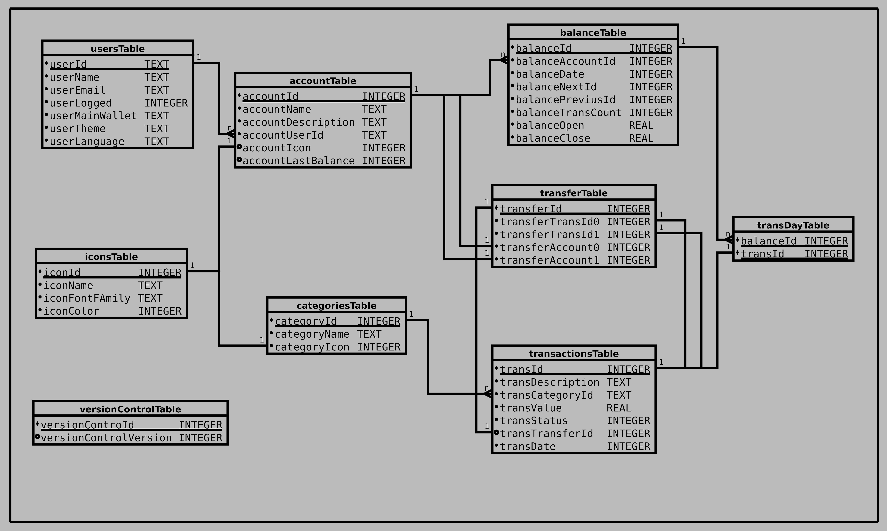

# Finance App (pt_BR)

By *rudsonalves67@gmail.com*

The intention of this project is to develop an application to assist in user budget control, allowing the creation and management of accounts. The project was inspired by the diagram published on Figma, [Financy-App](https://www.figma.com/file/vQzApZhqZFDFp1td5K4asQ/Financy-App?type=design&mode=design&t=EFvH3bvOxfe8hSap-0), and was initially developed based on videos from the YouTube channel [@devkaio](https://www.youtube.com/@devkaio), to which I am very grateful for the good practices and interesting ideas that helped implement the project.

## Code Development

This project aims to enhance my knowledge in the Flutter SDK and the entire ecosystem involved in application development.

Overall, the project is being developed following a feature-based architecture, where components and modules related to a specific feature are grouped into a logical structure, facilitating code comprehension and maintenance.

Pages are built using the State pattern, where the page's construction changes when its internal state changes. Generally, a page will have a module with an abstract class, and its subclasses extend this abstract class to define their different states. A second control module is responsible for managing the states used in the page's construction. The third module is responsible for building the page itself, depending on the current state.

The Service Locator used is *get_it*, which provides a way to centralize and obtain instances of necessary services throughout the application. It is also capable of generating Singleton objects and on-demand instances, offering great flexibility in resource distribution and control.

## Project Planning

1. The first version of the application will have the following features:

   - Creation and management of accounts in Firebase;
   - Local database with all wallet information;
   - Local login control (*flutter_secure_storage*);
   - Implementation of a settings page with:
     - Theme control;
     - Language selection;
     - Other product information (possibly an *About* page);
   - Support for Portuguese and English languages;
   - Single wallet functionality.

2. For upcoming versions, the plan includes:

   - Support for multiple wallets;
   - Addition of general graphical analysis;
   - Support for one more language (Spanish).

## Resources

Initially, the application will only manage financial movements for one wallet. In future versions, I plan to implement graphical financial analysis, projections, and support for multiple wallets.

The application uses the following packages:

- **get_it: ^7.6.0** - provides access to application components throughout the widget tree. Service Locator;
- **firebase_auth: ^4.6.1** - authentication;
- **firebase_core: ^2.13.0**;
- **flutter_secure_storage: ^8.0.0** - storage of login information and application status. Eventually, I plan to replace it with the *sqflite* package;
- **sqflite: ^2.2.8+4** - database for storing user wallet information;
- **path_provider: ^2.0.15** - obtaining commonly used locations in the host platform's file system, such as temporary and application data directories;
- **path: ^1.8.3** - library for path manipulation based on strings;
- **intl: ^0.18.0** - will be used for date formatting and parsing;
- **flutter_localization: ^3.0.2** - Flutter's standard internationalization;
- **dynamic_color: ^1.6.5** - Flutter package to create material color schemes based on dynamic platform-specific color implementations.

The project also uses icons from [Material Symbols](https://fonts.google.com/icons).

## Database

### 1. Table "usersTable":

This table is used to store information about users, such as their IDs, names, email addresses, and login status (0 - false and 1 - true), theme, language, and others.

### 2. Table "accountTable":

This table is used to store information about user accounts. Each account has an ID, a name, an associated user ID, and an image.

Index created for the *accountUserId* column.

The *accountLastBalance* column has been added to store the ID of the last balance recorded in the wallet. Financial movement queries will start from this balance and move backward in time until finding a balance with a null *balancePreviousId*, indicating that this is the first balance recorded in this wallet. Similarly, the *balanceNextId* of the balance with an *id* equal to *accountLastBalance* should be null, indicating that this is the last balance recorded in the account.

### 3. Table "balanceTable":

This table is used to store information about wallet balances on the specified *balanceDate*. Each entry in the table represents a specific balance in a wallet. Fields include the ID of the associated wallet, the balance ID, the IDs of the previous and next balances, as well as the opening and closing values of the balance. Essentially, this table is a linked list of balances.

Index created for the *balanceDate* and *balanceAccountId* columns.

A null value in *balancePreviousId* indicates that this is the first balance recorded in this account. Similarly, a null value in *balanceNextId* indicates that this is the last balance recorded in this account.

### 4. Table "categoriesTable":

This table is used to store information about categories of financial transactions. Each category has an ID, a name, and an associated image.

Index created for the *categoryName* column.

### 5. Table "transactionsTable":

This table is used to store information about financial transactions. Each transaction has an ID, a description, a category ID, a value, a status, and a date.

Index created for the *transDate* column.

A *transTransferId* column was added to store the ID of a transfer between accounts. This column can be null, indicating that the transaction is not a transfer between accounts. This column was added to facilitate the identification of transactions related to a transfer, as well as the data of this transfer.

### 6. Table "transDayTable":

This table is used to relate specific transactions to specific balances in the *balanceTable*. It is used as a junction table to create a relationship between transactions and balances in wallets.

### 7. Table "transfersTable":

This table maintains information about the IDs of transactions and the accounts where a transfer was initiated.

### 8. Table "versionControlTable":

This table was created to maintain control over database versions.

### 9. Table "iconsTable":

This table maintains icon definitions (name, fontFamily, color) used in categoriesTable and accountsTable.

### Triggers

Two triggers were created to validate entries in the *balanceNextId* and *balancePreviousId* columns in the *balanceTable*. In the trigger bodies, it is checked whether the value inserted in *balanceNextId* or *balancePreviousId* is null or corresponds to a valid *balanceId* in the *balanceTable*. Otherwise, an error is generated.

With these triggers in place, any attempt to insert an invalid value in *balanceNextId* or *balancePreviousId* will result in an error, and the insertion operation will be interrupted, thus maintaining the referential

 integrity of this data.

# Aplicativo de Finanças (pt_BR)

Por *rudsonalves67@gmail.com*

O propósito deste projeto é criar um aplicativo que auxilie os usuários no controle de seu orçamento. Ele permite a criação e gerenciamento de contas, o acompanhamento dos movimentos financeiros organizados em categorias personalizadas e a elaboração e execução de orçamentos. Este projeto foi inspirado no diagrama disponível no Figma, [Financy-App](https://www.figma.com/file/vQzApZhqZFDFp1td5K4asQ/Financy-App?type=design&mode=design&t=EFvH3bvOxfe8hSap-0), e inicialmente desenvolvido com base nos vídeos do canal do YouTube [@devkaio](https://www.youtube.com/@devkaio). Sou imensamente grato por suas práticas recomendadas e ideias inovadoras que contribuíram para a implementação deste projeto.

## Sobre o Desenvolvimento do Código

Este projeto tem como objetivo aprimorar meus conhecimentos no SDK Flutter e em todo o ecossistema envolvido no desenvolvimento do aplicativo.

No geral, o projeto está sendo desenvolvido seguindo uma arquitetura baseada em funcionalidades, na qual os componentes e módulos relacionados a uma determinada funcionalidade são agrupados de forma lógica, facilitando a compreensão e a manutenção do projeto.

As páginas são construídas usando o padrão State, no qual a construção da página é alterada quando seu estado interno muda. Em geral, uma página terá um módulo com uma classe abstrata, e suas subclasses estendem essa classe abstrata para definir diferentes estados. Um segundo módulo de controle é responsável por gerenciar os estados utilizados na construção da página. O terceiro módulo é responsável pela construção da própria página, dependendo do estado atual.

O Service Locator utilizado é o *get_it*, que oferece uma maneira de centralizar e obter instâncias de serviços necessários em todo o aplicativo. Ele também é capaz de gerar objetos Singleton e sob demanda, proporcionando flexibilidade na distribuição e controle dos recursos.

O banco de dados empregado será o SQFLite, uma implementação do SQLite para o Flutter amplamente popular entre os desenvolvedores.

## Objetivos do App

O Finances tem como objetivo ser uma ferramenta que ajude os usuários a acompanhar seus gastos e gerenciar melhor sua vida financeira.

O Finances permitirá aos usuários administrar uma quantidade ilimitada de contas, classificando suas despesas em categorias personalizáveis e criando e acompanhando a execução de seu orçamento.

### Privacidade

A única informação pessoal coletada pelo Finances é um endereço de e-mail e senha específicos para o aplicativo, necessários para o cadastro de uma conta no Firebase da Google. Isso é usado exclusivamente para armazenar essas credenciais.

O Finances foi projetado para ser o menos intrusivo possível, não retendo nenhuma informação pessoal ou sensível relacionada à segurança ou privacidade do usuário. Todas as informações das movimentações financeiras são armazenadas exclusivamente no dispositivo do usuário e não são compartilhadas de forma alguma pelo aplicativo.

## Descrição do App

O Finances conta com quatro páginas principais e algumas páginas secundárias eventuais (até o momento, apenas a página de configurações e a página "Sobre"). Essas páginas são selecionadas por meio de um PageView na barra inferior do aplicativo. Abaixo, segue uma breve apresentação dessas páginas.

* Página de Transações - Esta é a página principal do aplicativo, onde as transações são inseridas, as diferentes contas podem ser selecionadas e o balanço de cada mês pode ser acompanhado.
* Página de Estatísticas - Nesta página, é possível acompanhar as estatísticas anuais de seus gastos, bem como das diferentes categorias declaradas.
* Página de Contas - Nesta página, você pode adicionar, remover ou editar novas contas no aplicativo.
* Página de Orçamento/Categorias - Aqui, é possível adicionar, remover ou editar categorias para os pagamentos, além de definir o orçamento mensal.

Existe também uma quinta página para ajustar as configurações do aplicativo. Você pode acessá-la através do menu no canto superior direito da Página de Transações. Por meio dessa página, é possível selecionar o tema, a linguagem e fazer backup e recuperação de seus dados.

Estas páginas são detalhadas na sequência.

### Página de Transação:

A página de Transação permite adicionar, remover e editar as transações. 

A adição de novas transações é feita pressionando o botão (+) na base da página inicial

A edição e remoção de uma transação é feita deslizando a transação para direit (editar) ou para a esquerda (deletar).

"conferência"

## Planejamento do Projeto

1. A primeira versão do aplicativo terá as seguintes características:

   - Criação e gerenciamento de contas no Firebase;
   - Banco de dados local com todas as informações das carteiras;
   - Controle local de login (*flutter_secure_storage*);
   - Implementação de uma página de configurações com:
     - Controle de tema;
     - Seleção de idioma;
     - Outras informações sobre o produto (possivelmente uma página *Sobre*);
   - Suporte aos idiomas português e inglês;
   - Funcionalidade de carteira única.

2. Para as próximas versões, está planejado:

   - Suporte a múltiplas carteiras;
   - Adição de análises gráficas gerais;
   - Suporte a mais um idioma (espanhol).

## Recursos

Inicialmente, o aplicativo irá gerenciar apenas a movimentação financeira de uma carteira. Em versões futuras, pretendo implementar análises gráficas das finanças, projeções e suporte a várias carteiras.

O aplicativo utiliza os seguintes pacotes:

- **get_it: ^7.6.0** - fornece acesso a componentes do aplicativo ao longo da árvore de widgets. Service Locator;
- **firebase_auth: ^4.6.1** - autenticação;
- **firebase_core: ^2.13.0**;
- **flutter_secure_storage: ^8.0.0** - armazenamento de informações de login e status do aplicativo. Eventualmente, pretendo substituí-lo pelo pacote *sqflite*;
- **sqflite: ^2.2.8+4** - banco de dados para armazenamento das informações das carteiras do usuário;
- **path_provider: ^2.0.15** - obtenção de locais comumente usados no sistema de arquivos da plataforma host, como diretórios temporários e de dados do aplicativo;
- **path: ^1.8.3** - biblioteca para manipulação de caminhos baseada em strings;
- **intl: ^0.18.0** - será usado para formatação e análise de datas;
- **flutter_localization: ^3.0.2** - internacionalização padrão do Flutter;
- **dynamic_color: ^1.6.5** - pacote Flutter para criar esquemas de cores de materiais com base na implementação de cores dinâmicas de uma plataforma.

O projeto também utiliza os ícones do [Material Symbols](https://fonts.google.com/icons).

## Banco de Dados

### 1. Tabela "usersTable":

Essa tabela é usada para armazenar informações sobre os usuários, como seus IDs, nomes, endereços de e-mail e estado de login (0 - false e 1 - true), tema, linguagem e outros.

### 2. Tabela "accountTable":

Essa tabela é usada para armazenar informações sobre as contas dos usuários. Cada conta possui um ID, um nome, um ID de usuário associado e uma imagem.

Índice criado para a coluna *accountUserId*.

A coluna *accountLastBalance* foi adicionada para armazenar o ID do último saldo registrado na carteira. As consultas de um lançamento financeiro irão começar por este saldo e retroceder no tempo até encontrar um saldo com *balancePreviousId* nulo, indicando que este é o primeiro saldo registrado nesta carteira. De forma semelhante, o *balanceNextId* do saldo com *id* igual a *accountLastBalance* deve ser nulo, indicando que este é o último saldo registrado na conta.

### 3. Tabela "balanceTable":

Essa tabela é usada para armazenar informações sobre os saldos das carteiras na data especificada em *balanceDate*. Cada entrada na tabela representa um saldo específico em uma carteira. Os campos incluem o ID da carteira associada, o ID do saldo, os IDs do saldo anterior e seguinte, bem como os valores de abertura e fechamento do saldo. Essencialmente, essa tabela é uma lista encadeada dos saldos.

Índice criado para as colunas *balanceDate* e *balanceAccountId*.

Um valor nulo em *balancePreviousId* indica que este é o primeiro saldo registrado nesta conta. De forma semelhante, um valor nulo em *balanceNextId* indica que este é o último saldo registrado nesta conta.

### 4. Tabela "categoriesTable":

Essa tabela é usada para armazenar informações sobre as categorias das transações financeiras. Cada categoria possui um ID, um nome e uma imagem associada.

Índice criado

 para a coluna *categoryName*.

### 5. Tabela "transactionsTable":

Essa tabela é usada para armazenar informações sobre as transações financeiras. Cada transação possui um ID, uma descrição, um ID de categoria, um valor, um status e uma data.

Índice criado para a coluna *transDate*.

Foi adicionada uma coluna *transTransferId* para armazenar a ID de uma transferência entre contas. Esta coluna pode ser nula, indicando que a transação não se trata de uma transferência entre contas. Esta coluna foi adicionada para facilitar a identificação das transações relativas a uma transferência, bem como os dados desta transferência.

### 6. Tabela "transDayTable":

Essa tabela é usada para relacionar transações específicas com saldos específicos na tabela *balanceTable*. Ela é usada como uma tabela de junção para criar uma relação entre transações e saldos nas carteiras.

### 7. Tabela "transfersTable":

Esta tabela mantém as informações das IDs das transações e das contas onde uma transferência foi criada.

### 8. Tabela "versionControlTable":

Esta tabela foi criada para manter o controle de versões do banco de dados.

### 9. Tabela "iconsTable":

Esta tabela mantém as definições de ícones (nome, fontFamily, cor), usadas em categoriesTable e accountsTable

### Gatilhos

Foram criados dois gatilhos (triggers) para validar as entradas das colunas *balanceNextId* e *balancePreviousId* na tabela *balanceTable*. No corpo dos gatilhos, é verificado se o valor inserido em *balanceNextId* ou *balancePreviousId* é nulo ou corresponde a um *balanceId* válido na tabela *balanceTable*. Caso contrário, um erro é gerado.

Com esses gatilhos em vigor, qualquer tentativa de inserir um valor inválido em *balanceNextId* ou *balancePreviousId* resultará em um erro, e a operação de inserção será interrompida, mantendo assim a integridade referencial desses dados.

# Bug Fixes and Implementations

Some bugs were noticed and need to be fixed:

- *20231002.1* adjust: Fiz a besteira de implementar pelo nome da categoria alguns códigos (como CategoryController, StatisticsController, alguns como RepositorCategory). Isto gera um problema, pois al alterar o nome de uma categoria tenho de refazer todos estes registros para que não gerem problemas. Trocar estas indexações para os ids das categorias. Al fazer isto não será mais necessário solicitar um reCalculate ao StatisticsPage por alteração em nomes de categorias.
- *20231002.2* implementation: implemnetar um sistema de logger para o app. 

# Commits:

## 2023/10/02 - Versão 1.0.0+17:

In this commit, the app's name was changed to "Manage Your Finances," a bug related to the recalculation of statistics on the StatisticsPage was fixed, and some icons from MaterialIcons were removed while others were added from FontelloIcons.

 * lib/common/constants/themes/icons/fontello_icons.dart:
 * lib/common/constants/themes/icons/fontello_icons_codes.dart:
   - Added more icons.
   - lib/common/constants/themes/icons/material_icons_codes.dart:
   - Removed a series of less useful icons.
 * lib/common/widgets/custom_button_navigator_bar.dart:
 * lib/features/budget/budget_page.dart:
 * lib/features/statistics/widgets/variation_column.dart:
   - Adjusted icon names.
 * lib/features/help_manager/main_manager.dart:
   - The method managerTutorial has been transformed into a Future method.
 * lib/features/home_page/home_page.dart:
   - Added the attribute _showTutorial to display the tutorial when starting the app with an empty database. The scheduling for the tutorial presentation is done by adding a WidgetsBinding.instance.addPostFrameCallback, calling managerTutorial on page 0.
 * lib/features/home_page/widgets/transaction_dismissible_tile.dart:
   - No longer necessary to call statController.getStatistics;
   - Added a locator.get<StatisticsController>().requestRecalculate() for changes in categories.
 * lib/features/budget/budget_controller.dart:
 * lib/features/statistics/statistic_controller.dart:
   - init() is now called each time on entering the StatisticsPage, which changed some operations in this controller;
   - The attributes and methods redraw have been changed to recalculate, as they now refer to a request to recalculate statistics and not to redraw the page;
Added the method calculateStatistics() to group the statistics calculation process.
 * lib/features/statistics/statistics_page.dart:
   - StatisticsPageState is no longer an AutomaticKeepAliveClientMixin and is redrawn on each entry to the page. At least for now.
 * lib/l10n/app_??.arb:
   - Changed the app's name.

## 2023/09/30 - Version: 1.0.0+15

In this commit, several help/tutorial pages were added, and some adjustments were made to the menus of the main pages to incorporate a help system. The changes are detailed below:
 * assets/images/*
 * assets/images_svg/*
   - Addition of various images for creating help/tutorial pages. These images are currently in pt_BR but will be regenerated in en_US for the final product.
 * lib/common/constants/help_manager.dart:
   - This help manager is a singleton responsible for presenting help pages. It still needs to be integrated to control the tutorial pages exposed in the app.
 * lib/features/help_manager/main_manager.dart:
   - This module has a MainHelpManager class to expose the help pages and a managerTutorial(BuildContext context, [int index = 0]) function to control this exposure.
 * lib/features/help_manager/pages/page_model.dart:
   - This abstract class PageModel defines the signatures of all help pages presented below.
 * lib/features/help_manager/pages/accounts_delete_help.dart:
 * lib/features/help_manager/pages/accounts_edit_help.dart:
 * lib/features/help_manager/pages/accounts_help.dart:
 * lib/features/help_manager/main_manager.dart:
 * lib/features/help_manager/pages/accounts_delete_help.dart:
 * lib/features/help_manager/pages/accounts_edit_help.dart:
 * lib/features/help_manager/pages/accounts_help.dart:
 * lib/features/help_manager/pages/budget_set_help.dart:
 * lib/features/help_manager/pages/categories_budget_help.dart:
 * lib/features/help_manager/pages/categories_edit_help.dart:
 * lib/features/help_manager/pages/categories_help.dart:
 * lib/features/help_manager/pages/icons_color_help.dart:
 * lib/features/help_manager/pages/icons_selection_help.dart:
 * lib/features/help_manager/pages/presentation_help.dart:
 * lib/features/help_manager/pages/statistics_card.dart:
 * lib/features/help_manager/pages/statistics_help.dart:
 * lib/features/help_manager/pages/statistics_menu.dart:
 * lib/features/help_manager/pages/statistics_move_help.dart:
 * lib/features/help_manager/pages/transactions_add_help.dart:
 * lib/features/help_manager/pages/transactions_card_help.dart:
 * lib/features/help_manager/pages/transactions_edit_help.dart:
 * lib/features/help_manager/pages/transactions_help.dart:
   - These are the help pages built for the app.
 * lib/features/home_page/widgets/home_popup_menu_buttons.dart:
   - Removal of the helpDialog method. This is no longer used;
   - Use of managerTutorial(context, 1) to present the help on page 1;
 * lib/features/onboarding/onboarding_page.dart:
 * lib/features/sign_in/sign_in_page.dart:
 * lib/features/sign_up/sign_up_page.dar:
   - locale.???PageMsgPart0 and locale.???PageMsgPart1 messages have been consolidated into locale.???PageMsg0.
 * lib/features/settings/settings_page.dart:
   - Addition of a dialog to restart the app in case of a language change.
 * lib/features/statistics/statistics_page.dart:
   - Menu change to accommodate an option for the help dialog. 
 * lib/l10n/app_?.arb:
   - Merging messages ???PageMsgPart0 and ???PageMsgPart1 into a single ???PageMsg0;
   - Addition of messages for the help pages;
   - Addition and correction of other messages.
 * lib/repositories/category/sqflile_category_repository.dart:
   - Adjustment in the updateCategoryBudget method to update the local value of categoryBudget in the _categories[category.categoryName]!.categoryBudget map. This speeds up map updates without the need to access the database again.
 * pubspec.yaml:
  - version: 1.0.0+15

## 2023/09/27 - Version: 1.0.0+12

In this commit, several enhancements and improvements were made. Notable changes include translating the accountName to the system language, optimizing the order of buttons in the BottomNavigationBar for better usability, and refining the handling of language localization using AppLocale. Additionally, more translations were added, and the firstCategory method now accepts an AppLocalizations locale for generating translations related to system language preferences.

* lib/common/current_models/current_account.dart:
   - The `accountName` is now translated to the system language using `locator.get<AppLocale>`, which seems to work well during system initialization.

* lib/common/widgets/custom_botton_navigator_bar.dart:

* lib/features/home_page_view/home_page_view.dart:
   - Changed the order of buttons in the `BottonNavigatorBar`. The new order is more suitable for the system's usage cycle.

* lib/features/sign_in/sign_in_page.dart:

* lib/features/sign_in/sign_in_controller.dart:
   - The `createLocalUser` method now takes the `AppLocalizations` `locale` as a parameter to pass to the `firstCategory` method of `CategoryRepository`.

* lib/features/sign_up/sign_up_page.dart:

* lib/features/sign_up/sign_up_controller.dart:
   - The `doSignUp` method now receives the `AppLocalizations` `locale` for the user's default language selection and also passes it to the `firstCategory` method of `CategoryRepository`.

* lib/features/splash/splash_controller.dart:
   - The `isUserLogged` method has been changed to a `Future` method.

* lib/features/splash/splash_page.dart:
   - The `locator.get<AppLocale>()` object is initialized in this widget because it's the first place where a valid context can be obtained. This is done in the `didChangeDependencies` method and then in the `build` of the widget. This was necessary because it seemed that the initialization failed in some instances.

* lib/l10n/app_?.arb:
   - Updates and additions of more translations.

* lib/locator.dart:
   - Registered a Lazy Singleton of the `AppLocale` object. This is used for app internationalization during initialization.

* lib/repositories/category/category_repository.dart:
   - The `firstCategory` method now receives an `AppLocalizations` `locale` to generate translations for the system's language for the 'Transfers' and 'Inputs' categories.

## 2023/09/25 - version 1.0.0+11

In this commit, several changes have been made to the code to improve budget and category management within the app. These changes aim to simplify and optimize the budget update process, as well as enhance code organization. Key changes include the use of the updateCategoryBudget method in the CategoryRepository to update budget changes, renaming of classes and files related to budgets and categories, and some modifications to translations. The detailed changes can be found below.

 * lib/features/budget/budget_controller.dart:
   - Using the `updateCategoryBudget(category)` method in the `CategoryRepository` to update budget changes.

 * lib/features/budget/budget_page.dart:
   - The `budgetEdit` method has been altered to manage the budget appropriately. Among the changes, the removal of `SimpleDialog` in favor of a dedicated class can be highlighted.
   - Renamed `DismissibleBudget` to `DismissibleCategory`.

 * lib/features/budget/widget/add_budget_dialog.dart:
   - Renamed to `add_category_dialog.dart`.

 * lib/features/budget/widget/dismissible_budget.dart:
   - Renamed to `dismissible_category.dart`.

 * lib/features/home_page_view/home_page_view.dart:
   - Renamed `AddBudgetDialog` to `AddCategoryDialog`.

 * lib/features/transaction/transaction_page.dart:
   - Renamed `AddBudgetDialog` to `AddCategoryDialog`.

 * lib/l10n/app_?.arb:
   - Some changes to translations.

 * lib/repositories/category/category_repository.dart:
   - Added the method `Future<void> updateCategoryBudget(CategoryDbModel category)`.

 * lib/services/database/database_helper.dart: * 
   - Added the method `Future<void> updateCategoryBudget(int id, double budget)`.

## 2023/09/24 - version 1.0.0+10:

In this commit, changes were made to improve code usability, accessibility, and efficiency. See the details below:

 * lib/common/constants/themes/colors/custom_color.dart:
   - The `CustomColors` class was created to simplify the addition of custom colors.
 * lib/common/functions/base_dismissible_container.dart:
 * lib/common/widgets/custom_button_navigator_bar.dart:
   - Updated the gray tone for disabled text to improve contrast.
 * lib/common/functions/card_income_function.dart:
 * lib/common/widgets/basic_text_form_field.dart:
 * lib/common/widgets/custom_bottom_app_bar_item.dart:
 * lib/common/widgets/custom_floating_action_button.dart:
 * lib/common/widgets/custom_modal_bottom_sheet.dart:
 * lib/common/widgets/custom_text_button.dart:
 * lib/common/widgets/large_bold_text.dart:
 * lib/common/widgets/password_text_form_field.dart:
 * lib/common/widgets/primary_button.dart:
 * lib/common/widgets/secondary_button.dart:
 * lib/features/account/widgets/dismissible_account_card.dart:
 * lib/features/budget/budget_page.dart:
 * lib/features/budget/widget/dismissible_budget.dart:
 * lib/features/home_page/balance_card/balance_card.dart:
 * lib/features/home_page/home_page.dart:
 * lib/features/home_page/widgets/transaction_dismissible_tile.dart:
 * lib/features/onboarding/onboarding_page.dart:
 * lib/features/sign_in/sign_in_page.dart:
 * lib/features/splash/splash_page.dart:
 * lib/features/statistics/widgets/list_tile_statistic.dart:
   - Removed calls to the Semantics widget. These widgets already have accessibility by default, so Semantics are not necessary here.
 * lib/common/models/category_db_model.dart:
   - Added support for the new attribute `categoryIsIncome`.
 * lib/common/widgets/color_button.dart:
   - Some simplifications were made in this widget.
 * lib/common/widgets/row_of_two_buttons.dart:
   - Replaced TextButtons with TextButton.icon to emphasize selection;
   - Used the color `Colors.transparent` instead of `colorScheme.onInverseSurface`.
 * lib/features/budget/widget/add_budget_dialog.dart:
   - Added support for the new attribute `categoryIsIncome`.
 * lib/features/budget/widget/select_icon_row.dart:
   - Adjustments to the `SelectIconRow` class.
 * lib/features/sign_up/sign_up_page.dart:
   - Layout adjustments for text presentation.
 * lib/features/statistics/statistic_card/statistic_card.dart:
   - Added a Tooltip to improve app accessibility;
   - Updated the gray tone for disabled text to improve contrast.
 * lib/features/transaction/transaction_page.dart:
   - Added a Tooltip to improve app accessibility;
   - Improved dialog presentation;
   - Added support for the `category.categoryIsIncome` attribute;
   - Removed unnecessary Semantics.
 * lib/l10n/app_?.arb:
   - Added 11 new translations and some corrections.
 * lib/services/database/sqflite_helper.dart:
   - Advanced the database scheme to Version 1.0.05;
   - Added the `categoryIsIncome` column to the `categoriesTable` as `INTEGER DEFAULT 0`.

## 2023/09/22 - version 1.0.0+9:

Version 1.0.0+9 brings various accessibility improvements and minor adjustments to the app. It includes redesigning the app icon, adding documentation for Google Play, and enhancing the accessibility of many app elements. These enhancements make the app more user-friendly and accessible, particularly for users with disabilities or those who rely on assistive technologies. Additionally, new translations have been added to improve the app's language support, and the Lazy Singleton for the BudgetController object has been registered in the app's locator. These updates aim to enhance the overall user experience and accessibility of the application.

* assets/icons/finances_logo2.svg:
   - Slight redesign of the app icon.
* docs/Google.md:
   - Added documentation for Google Play.
* lib/common/functions/card_income_function.dart:
   - Added accessibility to the cardIncomeFunction.
* lib/common/functions/function_alert_dialog.dart:
* lib/common/widgets/add_cancel_buttons.dart: 
* lib/common/widgets/widget_alert_dialog.dart:
* lib/features/database_recover/database_recover.dart:
   - Employed AppButtonStyles.primaryButtonColor for dialog standardization.
* lib/common/models/user_name_notifier.dart:
   - Added UserNameNotifier class to facilitate user name changes throughout the app.
* lib/common/widgets/basic_text_form_field.dart:
   - Added accessibility to the BasicTextFormField class.
* lib/common/widgets/custom_bottom_app_bar_item.dart:
   - Added accessibility to the CustomBottomAppBarItem class.
* lib/common/widgets/custom_floating_action_button.dart:
   - Added accessibility to the CustomFloatingActionButton class.
* lib/common/widgets/custom_modal_bottom_sheet.dart:
   - Added accessibility to the CustomModalBottomSheet class.
* lib/common/widgets/custom_text_button.dart:
   - Added accessibility to the CustomTextButton class;
   - Made some layout adjustments.
* lib/common/widgets/large_bold_text.dart:
   - Added accessibility to the LargeBoldText class.
* lib/common/widgets/password_text_form_field.dart:
   - Added accessibility to the PasswordTextFormField class.
* lib/common/widgets/primary_button.dart:
   - Added accessibility to the PrimaryButton class.
* lib/common/widgets/secondary_button.dart:
   - Added accessibility to the SecondaryButton class.
* lib/features/account/widgets/dismissible_account_card.dart:
   - Added accessibility to the DismissibleAccountCard class.
* lib/features/budget/budget_page.dart:
   - Added accessibility to the BudgetPage class.
* lib/features/budget/widget/dismissible_budget.dart:
   - Added accessibility to the DismissibleBudget class.
* lib/features/budget/widget/icon_selection_dialog.dart:
   - Layout changes.
* lib/features/home_page/balance_card/balance_card.dart:
   - Added accessibility to the BalanceCard class.
* lib/features/home_page/home_page.dart:
   - Added accessibility to the HomePage class.
* lib/features/home_page/widgets/transaction_dismissible_tile.dart:
   - Added accessibility to the TransactionDismissibleTile class.
* lib/features/onboarding/onboarding_page.dart:
   - Added accessibility to the OnboardingPage class.
* lib/features/settings/settings_page.dart:
   - Some layout changes;
   - Added user name editing;
   - Added accessibility to the SettingsPage class.
* lib/features/sign_in/sign_in_page.dart:
   - Added accessibility to the SignInPage class.
* lib/features/sign_up/sign_up_page.dart:
   - Added accessibility to the SignUpPage class.
* lib/features/splash/splash_page.dart:
   - Added accessibility to the SplashPage class.
* lib/features/statistics/widgets/list_tile_statistic.dart:
   - Added accessibility to the ListTileStatistic class.
* lib/l10n/app_?.arb:
   - Added new translations.
* lib/locator.dart:
   - Registered the Lazy Singleton of the BudgetController() object.

## 2023/09/19 - version 1.0.0+3

* lib/features/account/widgets/statefull_add_account_dialog.dart:
* lib/features/budget/widget/add_budget_dialog.dart:
* lib/features/transaction/transaction_page.dart:
  - Used textCapitalization to format the contents of ...TextFormField.
* lib/features/budget/budget_controller.dart:
  - Used _statController.getStatistics(false) to avoid changing the state of the StatisticsPage. This is necessary to prevent 'setState() or markNeedsBuild() called when the widget tree was locked.'
  - Added a _state = BudgetStateSuccess() in the init() method. This is necessary to avoid an error message being displayed on the screen due to the controller not being initialized.
* lib/features/budget/budget_page.dart:
  - Added a toolTip for PopupMenuButton<StatisticMedium>.
* lib/features/database_recover/database_recover.dart:
  - Changed the presentation format of messages in the dialogCreateBackup dialog.
* lib/features/home_page/balance_card/balance_card.dart:
  - Changed the icons and colors of 'Check transactions' from Icons.toggle_... to Icons.lock_...
* lib/features/home_page/home_page.dart:
  - Changed the call to the _controller.getTransactions() method to _controller.init() in the init() method of HomePage. Just to standardize controller calls.
* lib/features/home_page/home_page_controller.dart:
  - Added the init() method to the HomePage controller.
* lib/features/settings/settings_page.dart:
* lib/features/home_page/widgets/home_popup_menu_buttons.dart:
  - Added a PopupMenuItem to invoke DatabaseRecover. This call was removed from the SteeginsPage.
* lib/features/home_page_view/home_page_view.dart:
  - Replaced WillPopScope with a PopScope. The former became deprecated after the latest update.
* lib/features/statistics/statistic_card/statistic_card.dart:
  - Changed the controller state to StatisticsStateSuccess() after initialization;
  - Added a doState attribute, with a default value of true, to disable the state change of StatisticsController. Some other pages require the data generated by StatisticsController.getStatistics, but changing the state on one page causes errors in the app.
* lib/features/statistics/statistics_page.dart:
  - Added tooTip.
* lib/services/authentication/mock_auth_service.dart:
* lib/services/database/managers/transactions_manager.dart:
* lib/services/database/sqflite_helper.dart:
  - TODOs were resolved or removed.

## 2023/09/11 - version 1.0.0+1

In this commit, some initialization errors of the app were fixed, the app's navigation order was changed, and some translations were added. Here are the changes:

* lib/app_finances.dart:
* lib/common/constants/routes/app_route.dart:
   - Added routing for the pages HomePage, StatisticsPage, AccountPage, and BudgetPage.

* lib/common/functions/function_alert_dialog.dart:
* lib/common/widgets/add_cancel_buttons.dart:
* lib/features/budget/widget/dismissible_budget.dart:
* lib/features/budget/widget/icon_selection_dialog.dart:
* lib/features/settings/settings_page.dart:
   - To better accommodate buttons on smaller screens, replaced ElevatedButton.icon with ElevatedButton.

* lib/common/widgets/custom_bottom_app_bar_item.dart:
   - Moved the code of CustomBottomAppBarItem to a separate module.

* lib/common/widgets/custom_botton_navigator_bar.dart:
   - Added some tooltips to the CustomBottomAppBarItems.

* lib/features/budget/budget_controller.dart:
   - To prevent an error in creating the chart on the BudgetPage, locator.get<StatisticsController>().getStatistics() is now only executed if there is data in the StatisticsController. This was necessary to avoid errors during app initialization without a database.

* lib/features/home_page/balance_card/balance_card_controller.dart:
* lib/features/home_page/home_page_controller.dar:
   - The initial date is set to the current date when starting the app without a database.

* lib/features/home_page_view/home_page_view.dart:
   - Whenever opening the StatisticsPage, a call to statisticeController.getStatistics() is made if the getter statisticeController.redraw returns true.

* /lib/features/home_page_view/home_page_view.dart:
   - A WillPopScope was added so that the smartphone's Back button always sends the PageView to the HomePage() before exiting the app.

* lib/features/sign_in/sign_in_page.dart:
* lib/features/sign_up/sign_up_page.dart:
* lib/features/splash/splash_page.dart:
   - Fixed app navigation to place AppRoute.home as the last page of the app.

* lib/features/statistics/graphics/line_graphic.dart:
   - Now the chart is only drawn if the getter locator.get<StatisticsController>().noData returns true. Otherwise, a Container with a message is returned.

* lib/features/statistics/statistic_controller.dart:
   - Implemented an attribute _noData to signal when some data is collected to generate statistics.

* lib/features/statistics/statistics_page.dart:
   - The didUpdateWidget method did not work as expected and is currently disabled.

* lib/features/transaction/transaction_page.dart:
   - Added translations for the phrases in transPageSelectAccTransfer, transPageAccTransfer, and transPageTitle. Finally, the translation of the phrase in accountPageTitle was fixed.

* pubspec.yaml:
   - Preparing for publication for version 1.0.0+1.

## 2023/09/08 - version 0.99.16

In this commit, version 0.99.16, the ability to display category charts has been added. There are still several adjustments to be made and translations to be fine-tuned. I also took the opportunity to remove some bugs in UserDbModel.toMap that I hadn't noticed in the last update. There are still issues with triggering refresh on different pages due to changes in categories, transactions, and accounts. I should address this in upcoming commits. Here are the details of the main changes:

* lib/common/models/user_db_model.dart:
   - Added a List<String>? userCategoryList to maintain a list of selected categories to display on the chart on the StatisticsPage;
   - Fixed a bug in the toMap() method for boolean variables. They now represent 1 for true and 0 for false;
   - Added specialized methods updateUserLanguage() and updateUserTheme() to update only these attributes in the database.

* lib/common/current_models/current_user.dart:
   - Added support for updateUserTheme and updateUserLanguage in the setUserTheme and setUserLanguage methods, respectively.

* lib/features/budget/budget_page.dart:
   - Added a call to StatisticsController.init() in the init() method of the BudgetPage. It was causing an error with the declaration of the internal _statReferenceType attribute of the StatisticsController.

* lib/features/home_page/home_page.dart:
* lib/features/settings/settings_page.dart:
   - Aesthetic adjustments.

* lib/features/statistics/statistic_card/statistic_card.dart:
   - Added an initState() method;
   - The old incomesExpensesData method was renamed to processesData and generates GraphicLineData for all the charts;
   - This Card now works with the controller of the StatisticsPage and a personal controller to build the chart.

* lib/features/statistics/statistic_card/statistic_cart.state.dart:
* lib/features/statistics/statistic_card/statistic_card_controller.dart:
   - StatisticCard controller. This controller waits for data processing in the StatisticsController to start separating chart data.

* lib/features/statistics/statistic_controller.dart:
   - Added the attributes Future<void>? _currentOperation and Completer<void>? _successCompleter. These are responsible for signaling when this controller transitions to the StatisticsStateSuccess() status.
   - The method Future<void> waitUntilSuccess() is responsible for informing that the controller's status has changed to StatisticsStateSuccess().

* lib/features/statistics/statistics_page.dart:
   - The variationColumn function was removed and converted into a widget;
   - The entire ListTile widget was replaced with the ListTileStatistic(StatisticResult category) widget.

* lib/features/statistics/widgets/list_tile_statistic.dart:
   - The ListTile from the StatisticsPage was converted into this widget.

* lib/features/statistics/widgets/variation_column.dart:
   - The variationColumn function was converted into this widget.

* lib/locator.dart:
   - Registered the singleton for StatisticCardController().

* lib/repositories/user/sqflite_user_repository.dart:
* lib/services/database/database_helper.dart:
   - Added specialized methods Future<void> updateUserLanguage(UserDbModel user) and Future<void> updateUserTheme(UserDbModel user).

* lib/repositories/user/user_repository.dart:
* lib/services/database/sqflite_helper.dart:
   - Changed the database Scheme Version to 1.0.04 with the addition of the userCategoryList TEXT column with a default value of "[]";
   - Updated the _createUsersTable method with the new column;
   - Added specialized methods Future<int> updateUserLanguage(String id, String language) and Future<int> updateUserTheme(String id, String theme).

* pubspec.yaml:
   - Updated the app version to 0.99.16.

## 2023/09/07 - version 0.99.15

In this commit, changes were made to add the `userBudgetRef` attribute to control the app's statistical reference. At the same time, optimizations were made for writing app control attributes in the `usersTable` table. This was done to optimize the device resource usage when changing these attributes, by updating only the necessary attribute instead of rewriting the entire user record. The details of the changes are described below:

 * `lib/common/constants/app_constants.dart`:
   - Isolated the `StatisticMedium` enum in this constants module.
 * `lib/common/models/user_db_model.dart`:
   - Added the `StatisticMedium userBudgetRef` attribute.
   - Added methods `Future<void> updateUserBudgetRef()`, `updateUserGrpShowGrid()`, `updateUserGrpIsCurved()`, `updateUserGrpShowDots()`, and `updateUserGrpAreaChart()` for making specific updates in the database.
 * `lib/features/statistics/statistic_card/statistic_card.dart`:
   - Graphical attribute updates are now handled by specialized methods `updateUserGrpShowGrid`, `updateUserGrpIsCurved`, `updateUserGrpShowDots`, and `updateUserGrpAreaChart`.
 * `lib/features/statistics/statistic_controller.dart`:
   - Removed the `StatisticMedium` enum from this module to `app_constants.dart` as described above.
   - The `_statReferenceType` attribute is now initialized with the `userBudgetRef` attribute of `currentUser` (via `locator.get<CurrentUser>()`) in the `init()` method of the controller.
   - Updating `currentUser` in the data layer is done through the `updateUserBudgetRef` method described above.
 * `lib/repositories/user/sqflite_user_repository.dart`:
 * `lib/repositories/user/user_repository.dart`:
   - Added methods `Future<void> updateUserBudgetRef(UserDbModel user)`, `updateUserGrpShowGrid(UserDbModel user)`, `updateUserGrpShowDots(UserDbModel user)`, `updateUserGrpIsCurved(UserDbModel user)`, and `updateUserGrpAreaChart(UserDbModel user)` to update the respective attributes in the database. At this level, the interface between the database and the `UserDbModel` object (and `CurrentUser`) is implemented.
 * `lib/services/database/database_helper.dart`:
 * `lib/services/database/sqflite_helper.dart`:
   - The database has been updated to Schema Version 1.0.03, with the addition of the `userBudgetRef` attribute to the `usersTable` table.
   - The necessary migration script for adding the `userBudgetRef` column to the `usersTable` table in the database has been added to the migration script list.
   - The creation of the `usersTable` table has been updated to include the new `userBudgetRef` attribute.
   - Methods `Future<int> updateUserBudgetRef(String id, int budgetRef)`, `updateUserGrpShowGrid(String id, int grpShowGrid)`, `updateUserGrpShowDots(String id, int grpShowDots)`, `updateUserGrpIsCurved(String id, int grpIsCurved)`, and `updateUserGrpAreaChart(String id, int grpAreaChart)` have been added to effect changes to the database content for user attributes.

## 2023/09/06 - version 0.99.14

In this commit, I made several implementations to get the budget page up and running. The BudgetPage is complete, with only a few adjustments needed on the statisticsPage and some tweaks throughout the code. The changes in this commit were:

* lib/common/widgets/markdown_rich_text.dart:
   - Class renamed to MarkdownRichText;
   - Added alignment to the MarkdownRichText class.

* lib/features/budget/budget_controller.dart:
   - Added the _totalBudget attribute and its getter;
   - Added the _sumTotalBudget() method;
   - Added the updateCategoryBudget(CategoryDbModel category) method.

* lib/features/budget/budget_page.dart:
   - Added the Future<void> budgetEdit(CategoryDbModel category) method to edit the budgets of all categories;
   - Added the Future<void> updateBudget(CategoryDbModel category, String budget) method. This method updates the category only if the category.categoryBudget attribute is changed;
   - Added a PopupMenuButton to select the base for category budgets;
   - All widget distribution on this page was rearranged to keep "Total Budget" within the AnimatedBuilder.

* lib/features/budget/widget/dismissible_budget.dart:
   - Added the void Function(CategoryDbModel)? budgetEdit attribute to trigger budget editing from the BudgetPage;
   - Also corrected some button colors in the dialogs, but it needs a review to check other parts of the code;
   - The onTap attribute of the ListTile now calls widget.budgetEdit!(category). This is triggered when clicking on a category on the BudgetPage.

* lib/features/statistics/models/statistic_result.dart:
* lib/features/statistics/models/statistic_total.dart:
   - Code separated from StatisticalController.

* lib/features/statistics/statistic_controller.dart:
   - Added a StatisticMedium with attributes none, mediumMonth, medium12, and categoryBudget. These are the bases used in statistics and to build category.categoryBudget;
   - Added a list of categoryName x StatisticTotal, _totalByCategory, to store totals in each category;
   - Added the attribute and its getter, _statReferenceType, initially set as StatisticMedium.mediumMonth. This is used to set the statistics reference;
   - Added the Map<String, double> getReferences(StatisticMedium statReference) method to return a reference. This method was isolated from the _setReferenceByCategory() method so that it can be called externally to apply its values as bases in the budgets;
   - Added the Future<void> setStatisticsReference(StatisticMedium statReferenceType) method to control the state of the StatisticPage and change the statistical reference values.

* lib/features/statistics/statistics_page.dart:
   - Added the statReference attribute to the StatisticPage;
   - Changed some icons to improve the page's presentation;
   - Added a PopupMenuButton<StatisticMedium> using CheckedPopupMenuItem<StatisticMedium> as items.

* lib/l10n/app_.*.arb:
   - Added new translations.

## 2023/09/05 - version 0.99.12

In this commit, various updates and adjustments were made, including: removal of routing to the CategoryPage; addition of new icons and improvement of dialogs; addition of boolean columns for chart control; enhancements in state management; and performance improvements and bug fixes.

Here is a more detailed breakdown of the changes:

* lib/app_finances.dart:
* lib/common/constants/routes/app_route.dart:
  - Routing to CategoryPage() removed.
* lib/common/constants/themes/icons/fontello_icons.dart:
* lib/common/constants/themes/icons/fontello_icons_codes.dart:
  - Some icons were removed.
* lib/common/functions/function_alert_dialog.dart:
  - This dialog has been enhanced for the standardization of app dialogs. So far, only some adjustments have been made, but they still need to be applied throughout the app.
* lib/common/models/user_db_model.dart:
  - Added columns userGrpShowGrid, userGrpIsCurved, userGrpShowDots, and userGrpAreaChart. These columns are booleans to control the attributes of the StatisticsPage chart.
* lib/features/budget/budget_controller.dart:
  - Added the getter categoryNames to replicate the getter of the same name in CategoriesController;
  - Added a WidgetsBinding.instance.addPostFrameCallback to stack the calls to notifyListeners() in the _changeState method.
* lib/features/budget/budget_page.dart:
  - Added an AutomaticKeepAliveClientMixin to BudgetPage so that the page is not redrawn with each access.
* lib/features/budget/widget/add_budget_dialog.dart:
  - The controller is now accessed via locator.get<BudgetController>().
* lib/features/budget/widget/dismissible_budget.dart:
  - Added blocking for the deletion of categories with transactions.
* lib/features/category/category_controller.dart:
* lib/features/category/category_page.dart:
* lib/features/category/category_state.dart:
* lib/features/category/widgets/add_category_dialog.dart:
* lib/features/category/widgets/categories_header.dart:
* lib/features/category/widgets/dismissible_category.dart:
  - These codes have been removed. The CategoriesPage has been replaced by the BudgetPage, which performs the same function and is now part of the app's main scope.
* lib/features/home_page/widgets/home_popup_menu_buttons.dart:
  - PopupMenuItem related to invoking CategoriesPage has been removed.
* lib/features/home_page_view/home_page_view.dart:
  - The call to the AddBudgetDialog (formerly AddCategoryDialog) is now made through the app's floatingActionButton.
* lib/features/statistics/statistic_card/statistic_card.dart:
  - The attributes showGrid, isCurved, showDots, and areaChart are now controlled by the current user's attributes.
* lib/features/statistics/statistics_page.dart:
  - Replaced Icons.upload and Icons.download with FontelloIcons.up1 and FontelloIcons.down1, respectively.
* lib/features/transaction/transaction_page.dart:
  - TransactionPage now directly calls the AddBudgetDialog for adding new categories.
* lib/locator.dart:
  - Lazy Singleton CategoryController replaced by BudgetController.
* lib/services/database/sqflite_helper.dart:
  - databaseSchemeVersion updated to 1.0.02;
  - The usersTable had columns userGrpShowGrid, userGrpIsCurved, userGrpShowDots, and userGrpAreaChart added;
  - After invoking _updateMigration, code was added to close and reopen the database. This was necessary to avoid bugs after updating the tables.

## 2023/09/04 - version 0.99.11

In this commit, the following changes were made:

 * android/app/build.gradle:
   - Preparation for app publication on the Play Store.

 * android/app/src/main/AndroidManifest.xml:
   - Addition of an icon for the app.
   - Addition of internet access permission for the app. This is necessary for Firebase authentication.

 * assets/fonts/fontelloicons.ttf:
   - New icons have been added, most of them for use in the app's design.

 * lib/common/constants/routes/app_route.dart:
   - Added routing for the SettingsPage.

 * lib/common/constants/themes/icons/fontello_icons_codes.dart:
   - The icons down, up, down-fat, up-fat, budget_outlined, budget_page, budget2, and budget_outlined2 have been added.

 * lib/common/functions/base_dismissible_container.dart:
   - The disableColor has been changed to colorScheme.outlineVariant.

 * lib/common/models/category_db_model.dart:
   - The attribute categoryBudget has been added to the CategoryDbModel class.

 * lib/common/widgets/custom_button_navigator_bar.dart:
   - The Icons.settings icon has been replaced with FontelloIcons.budget2 for the new BudgetPage.

 * lib/features/category/widgets/icon_selection_dialog.dart:
   - The layout of this dialog has been reorganized, replacing the TextButton with an InkWell to reduce the space occupied by the row.
   - The search TextField has been placed within a Row along with a button to close the dialog. This button is not actually necessary but has been added for standardizing the action in the app.

 * lib/features/home_page/balance_card/balance_card.dart:
   - The Switch in the BalanceCard has been replaced with an IconButton featuring the Icons.toggle_on and Icons.toggle_off icons. This made the button narrower and more discreet in the BalanceCard.

 * lib/features/home_page/widgets/cart_popup_menu_buttons.dart has been moved to home_popup_menu_buttons.dart.

 * lib/features/home_page/widgets/transaction_dismissible_tile.dart:
   - The TransactionDismissibleTile now disables the edit/delete options if the transaction is checked.

 * lib/features/home_page_view/home_page_view.dart:
   - StatisticsPage, AccountPage, and SettingsPage no longer have initial parameters.
   - BudgetPage has been added to the PageView list.

 * lib/features/settings/settings_page.dart:
   - In addition to removing the backPage parameter, a button has been added to its appBar to return to the app's initial page.

 * lib/features/statistics/graphics/line_graphic.dart:
   - Adjustment to the labelX of the graph.

 * lib/l10n/app_*.arb:
   - Translations have been added for the BudgetPage, along with some corrections.

 * lib/services/database/database_helper.dart:
 * lib/services/database/sqflite_helper.dart:
   - The databaseSchemeVersion has been updated to version 1.0.01 with a test on the categoriesTable table alteration, including the addition of the categoryBudget column, which is of type real and has a default value of 0.
   - The method Future<int> countTransactionForCategoryId(int id) has been added to count transactions with the passed CategoryId. This will be used to prevent the deletion of a category being used in a transaction.

 * pubspec.yaml:
   - The version has been updated to 0.99.11.
   - The flutter_launcher_icons package has been added to generate the app's icon.

## 2023/08/31 - version 0.99.10

In this commit, a graph for incomes and expenses was added to the StatisticsPage, the colors of these were adjusted, and the indicator icon for incomes/expenses was changed. Additionally, I removed some explicit declarations where "final" is used. However, these changes are not listed below. Here are the modifications:

lib/features/home_page/widgets/transaction_dismissible_tile.dart:
corrected color of numbers.
lib/features/statistics/statistic_card/statistic_card.dart:
added graph for incomes and expenses vs. strDate;
corrected color of numbers and graph.
added new icons to indicate decrease and increase in average consumption in categories.
lib/features/statistics/statistic_controller.dart:
added getters for strDates.
pubspec.yaml:
added the fl_chart package version 0.63.0.

## 2023/08/30 - version 0.99.09

* lib/common/constants/themes/app_text_styles.dart:
  - Added the `textStyleBold10`.
* lib/features/account/account_page.dart:
  - Corrected the balance color for negative values.
* lib/features/statistics/statistic_controller.dart:
  - Added the calculation of the average of entries for different categories.
* lib/features/statistics/statistics_page.dart:
  - Added the `variationColumn` method to draw the variation in movement of a category;
  - Added an element to present the variations of a given category.

## 2023/08/29:

In this commit, one more color adjustment to the app and the addition of transaction status change were made. See the details of the changes below:

* lib/common/constants/themes/colors/color_schemes.g.dart:
* lib/common/constants/themes/colors/custom_color.g.dart:
  - One more adjustment to the app's theme colors.
* lib/common/models/transaction_db_model.dart:
  - Created a getter to return true if the transaction status is `TransStatus.transactionChecked`;
  - Added the method `toggleTransStatus` (and the auxiliary method `_toggleStatus`) to allow changing the transaction status and recording the change in the database.
* lib/features/home_page/balance_card/balance_card.dart:
  - Added a `Switch` button to enable and disable the transaction status change.
* lib/features/home_page/balance_card/balance_card_controller.dart:
  - Added a boolean attribute `_transStatusCheck` to control the `Switch` button of `BalanceCard`;
  - Added the method `Future<void> toggleTransStatusCheck` to enable and disable the `Switch` button of `BalanceCard`. This method changes the state of `BalanceCard` to force its redraw.
* lib/features/home_page/widgets/transaction_dismissible_tile.dart:
  - `TransactionDismissibleTile` has been changed to a `StatefulWidget` to allow a setState on the transactions on the `HomePage`;
  - Added the `onTap` method to the `ListTile` widget to trigger the transaction status change if `BalanceCardController.transStatusCheck` is true.
* lib/l10n/app_en.arb b/lib/l10n/*:
  - Updated with the translation of the tooltip for the `Switch` added to the `BalanceCard`.
* lib/services/database/sqflite_helper.dart:
  - added the method `updateTransactionStatus(int id, int newStatus)` to update only the transaction status for a transaction.

## 2023/08/28:

In this commit, four changes were made to the project:

- The project was renamed to "finances" and moved to another repository with the same name.
- Three more colors were added to the project's color palette: lightblue, lightgreen, and lightyellow.
- The line 'final locale = AppLocalizations.of(context)!' was moved from the beginning of the initState() method in the SignInPage class to inside the anonymous function within _controller.addListener. This was necessary to avoid an error during app execution.
- The methods 'Future<void> signInButton()' and 'void signUpButton()' were extracted from the build block of the SignUpPage class. This change was purely cosmetic, resulting in a more coherent code organization.

## 2023/08/27:

Adjusted iconData, decided to keep iconData being constructed by the app. Completed app internationalization using ChatGPT for message translation. Changes are as follows:
 * android/build.gradle:
   - Updated to version 1.7.10.
 * lib/common/functions/function_alert_dialog.dart:
 * lib/common/widgets/color_button.dart:
 * lib/features/category/category_page.dart:
 * lib/features/category/widgets/add_category_dialog.dart:
 * lib/features/category/widgets/dismissible_category.dart:
 * lib/features/category/widgets/icon_selection_dialog.dart:
 * lib/features/database_recover/database_recover.dart:
 * lib/features/home_page/home_page.dart:
 * lib/features/settings/settings_page.dart:
 * lib/features/sign_in/sign_in_page.dart:
 * lib/features/statistics/statistic_card/statistic_card.dart:
 * lib/features/statistics/statistics_page.dart:
   - Added internationalization.
 * lib/common/widgets/markdown_text.dart:
   - Created this module to generate RichText from Markdown phrases. Currently supports only bold text.
 * lib/features/account/account_page.dart:
   - Implemented the use of MarkdownText;
   - Added internationalization.
 * lib/l10n/app_en.arb:
 * lib/l10n/app_en_US.arb:
   - Added new texts;
   - Corrected spelling of some texts.
 * lib/l10n/app_es.arb:
 * lib/l10n/app_pt.arb:
 * lib/l10n/app_pt_BR.arb:
   - Revised translations.

## 2023/08/25

Changes:

 * android/app/build.gradle:
   - Added support for `firebase-analytics`.
   
 * android/app/google-services.json:
   - Updated.
   
 * lib/common/constants/themes/colors/custom_color.g.dart:
   - Added the red color, but it's causing some issues. I should redo the color scheme.
   
 * lib/features/account/account_page.dart:
   - Now, to delete an account, all transactions need to be removed first. Otherwise, the delete will be blocked.
   - A call to `locator.get<BalanceCardController>().requestRedraw()` is now made to redraw the `BalanceCard` when an account is added, modified, or deleted.
   
 * lib/features/home_page/balance_card/balance_card_controller.dart:
   - Added a `requestRedraw()` method to request the redraw of the `BalanceCard`.
   
 * lib/features/home_page/home_page.dart:
   - The `HomePage` is now redrawn only if a local command is requested.
   
 * lib/features/home_page/widgets/cart_popup_menu_buttons.dart:
   - Removed some debugging options from the `HomePage` menu.
   
 * lib/features/home_page_view/home_page_view.dart:
   - Added an `await`, which was apparently missing, and a call to `locator.get<StatisticsController>().requestRedraw()` to the `addTransaction()` method.
   
 * lib/features/statistics/statistic_controller.dart:
   - Added a `redraw` getter and a `requestRedraw()` method to schedule a statistics reconstruction.
   
 * lib/features/statistics/statistics_page.dart:
   - Now, the page remains static and is only redrawn when a transaction is added, edited, or removed.
   - This process is implemented by overriding the `didUpdateWidget` method, which is called every time the page gains or loses focus.
   
 * lib/locator.dart:
   - `TransactionController` is now registered as a `LazySingleton`. This was done to allow better control of the `HomePage` redraw, but it ended up not being used. It's marked for testing and removal if not needed.
   - `StatisticsController` registered as a `LazySingleton` for controlling the `StatisticsPage` redraw.
   
 * lib/services/database/sqflite_helper.dart:
   - `countTransactionsForAccountId` was fixed to properly count transactions for an account.
   
 * lib/services/logger/app_logger.dart:
   - This is under consideration for adding the `logger` package to the project.

## 2023/08/24b:

* android/build.gradle:
   - kotlin_version changed to 1.8.0.
* lib/common/models/extends_date.dart:
   - Fixed the bug on line 34. Changed from date.microsecond to date.millisecond;
   - Simplified the getMillisecondsIntervalOfMonth method by adding the methods _isLeapYear(int year) and _lastDayOfMonth(ExtendedDate date) and removing the _isLeap getter.
* lib/features/settings/settings_page_controller.dart:
* lib/features/settings/settings_page_state.dart:
* lib/features/settings/settings_page.dart:
   - The SettingsPage now utilizes a controller to manage the state. This was necessary to access the app version;
   - The app version is displayed on this page.
* lib/features/statistics/statistic_card/statistic_card.dart:
   - The state of this card is now controlled by the same controller as the StatisticPage.
* lib/features/statistics/statistic_controller.dart:
   - _incomes and _expenses have been transformed into Map<String, double>, with strDate as the key;
   - _statisticsList has been transformed into Map<String, List<StatisticResult>>, also with strDate as the key;
   - List<String> _strDates contains the list of strDate keys;
   - The strDate getter returns the strDate at _index;
   - The _index attribute holds the index of the selected strDate key;
   - The methods nextMonth() and previousMonth() switch between strDate keys.
* lib/features/statistics/statistics_page.dart:
   - The StatisticsPage class has been modified to use strDate as the index for statistics;
   - The rest of the class has been adapted to use the new attributes from StatisticsController.
* pubspec.yaml:
   - Added the package_info_plus package to gather app information.

## 2023/08/24:

* lib/common/widgets/custom_modal_bottom_sheet.dart:
   - The CustomModalBottomSheet now automatically resizes to adjust to the size of the displayed message.
* lib/features/database_recover/database_recover.dart:
   In this class, several code improvements have been implemented to enhance readability and flexibility. These include:
   - Addition of the enum DialogStates {create, restore, createRestore} to customize the type of dialog to be presented.
   - Introduction of the DialogStates dialogState attribute to choose the appropriate dialog type to display.
   - Inclusion of methods dialogMessage(), dialogCreateBackup(), dialogRestoreBackup(), and dialogDivider() to enhance code readability.
* lib/features/settings/settings_page.dart:
   - Adjusted the SettingsPage to appropriately select the DatabaseRecover dialog.
* lib/features/sign_in/sign_in_page.dart:
   - Modified the customModalBottomSheet call to display the DatabaseRecover(dialogState: DialogStates.restore) dialog if necessary.

## 2023/08/23:

  * android/app/src/main/AndroidManifest.xml:
    - added permission for the app to write and read in the device's storage area.
  * lib/common/widgets/custom_modal_bottom_sheet.dart:
    - at this first moment I added a button to restore data. This process will still be improved.
  * lib/common/widgets/secondary_button.dart:
    - I reimplemented this button with an OutlinedButton.
  * lib/features/database_recover/database_recover.dart:
    - controls the app's recover/backup dialog. I shall separate and improve this process later on.
  * lib/features/settings/settings_page.dart:
    - simplified it with just one button to call the recover/backup dialog.
  * lib/features/sign_in/sign_in_controller.dart:
    - just simplified some log messages to be less informative.
  * lib/features/sign_in/sign_in_page.dart:
    - Added the button to call the recover/backup dialog in the initState() method.
  * lib/features/statistics/statistic_card/statistic_card.dart:
    - some aesthetic tweaks. There is a bug in this code that is presenting the header and information out of sync.
  * lib/repositories/account/sqflite_account_repository.dart:
  * lib/repositories/backup/backup_repository.dart:
  * lib/repositories/category/category_repository.dart:
  * lib/repositories/category/sqflile_category_repository.dart:
  * lib/repositories/user/sqflite_user_repository.dart:
    - added restart() method to restart repository
  * lib/repositories/backup/sqlflite_backup_repository.dart:
    - control layer over sqflite to manage app backup/restore.
  * lib/services/database/database_helper.dart:
  * lib/services/database/sqlflite_helper.dart:
    - adjusted the Scheme database version;
    - added dbSchemeVersion() method to format database Scheme version;
    - added backupDatabase([String? destinyDir]) method to backup app database;
    - added method Future<bool> restoreDatabase(String newDbPath) to restore app database.
  * pubspec.yaml:
    - added file_picker package to generate dialog to access device directory tree.
   
## 2023/08/22:

Changes:
 * lib/common/constants/themes/icons/fontello_icons_codes.dart:
   - Added 6 more custom icons: sign-language, microchip, alimony, bill, services.
 * lib/common/functions/card_income_function.dart:
   - Added a function to assemble Incomes/Expenses for the Cards on the HomePage and Statistics pages.
 * lib/common/validate/sign_validator.dart:
   - Reduced the password validation requirement to only letters and numbers, up to 6 characters.
 * lib/common/widgets/autocomplete_text_form_field.dart:
   - Now removes focus from the widget after selecting one of the suggestions in AutocompleteTextFormField.
 * lib/features/account/widgets/dismissible_account_card.dart:
 * lib/features/home_page/balance_card/balance_card.dart:
   - Residues in the balance were causing negative values of 0.00. These operation residues have been removed to ensure the integrity of operations;
   - In BalanceCard, the method _incomeExpenseShowValue has also been removed and separated into an exclusive module for reuse by other Cards.
 * lib/features/home_page/home_page_controller.dart:
   - The maximum number of transactions to be presented on the HomePage is now an attribute of HomePageController and can be changed directly;
   - The function getNextTransactions can also receive an integer attribute "more" to limit the number of new transactions to be collected.
 * lib/features/statistics/statistic_card/statistic_card.dart:
 * lib/features/statistics/statistic_controller.dart:
 * lib/features/statistics/statistic_state.dart:
 * lib/features/statistics/statistics_page.dart:
   - Created a basic statistics page. This is not the final page yet, but it will be a starting point.
 * lib/services/database/sqflite_helper.dart:
   - The transDayTable has been changed to have only transDayTransId as the primary key;
   - The method getTransactionSumsByCategory({required int startDate, required int endDate}) has been added to return the sum of transactions in categories within the date range from startDate to endDate.

## 2023/08/19:

In this commit, I made the following changes:

1. I modified the prefixes of the `TransferDbModel` class and its associated elements from "transf" to "transfer". Additionally, I removed the `transfValue` and `transfDate` attributes as they were not being used.

2. I reviewed the logs to eliminate unnecessary ones, including debug logs. Furthermore, I improved the content of the remaining logs within the application.

3. I fixed a bug in the `AccountDropdownFormField` widget, which was related to incorrect usage of `accountId` instead of `accountName`. Now, the widget correctly returns the account name throughout the app.

Here's a breakdown of the changes in each file:

- `lib/common/models/transfer_db_model.dart`
- `lib/features/transaction/transaction_controller.dart`
- `lib/repositories/transfer_repository/sqflite_transfer_repository.dart`
- `lib/services/database/managers/transfers_manager.dart`
- `lib/services/database/sqflite_helper.dart`
  - Attributes now use the prefix "transfer" instead of "transf".
  - The attributes `transfValue` and `transfDate` have been removed.

- `lib/common/widgets/account_dropdown_form_field.dart`
  - I fixed a bug in the widget. Now, the widget correctly returns the `accountName` instead of the previously returned `accountId`, which was incorrect. `accountName` is now the default throughout the application.

- `lib/features/home_page/home_page.dart`
- `lib/features/home_page/widgets/transaction_dismissible_tile.dart`
  - I changed the class name `TransactionListTile` to `TransactionDismissibleTile` to better align with similar approaches in other parts of the project.

- `lib/features/sign_in/sign_in_page.dart`
- `lib/features/sign_up/sign_up_page.dart`
  - I modified the permanent logs to provide clearer error indications.

## 2023/08/18:

In this commit, several bugs were fixed. The description of the changes is provided below:

* lib/features/category/category_controller.dart:
  - Added a `WidgetsBinding.instance.addPostFrameCallback` before `notifyListeners` to synchronize frame rendering. This is used to enqueue the callback to the end of the next frame's layout.
  - Multiple calls to `_changeState` were removed, and the responsibility of state change is now concentrated solely within the `getAllCategories` method.

* lib/features/category/category_page.dart:
  - `addCategory()` has been converted into a `Future` function.
  - The ElevatedButton for adding now invokes the `AddCategoryDialog` class within a `showDialog` instead of the `statefullAddCategoryDialog`.

* lib/features/category/widgets/add_category_dialog.dart:
  - New class introduced to replace the `statefullAddCategoryDialog`. Issues with the `dispose` of `TextEditingController` used in the dialog prompted a more conventional approach to resolve the problem.

* lib/features/category/widgets/dismissible_category.dart:
  - Now utilizes the `AddCategoryDialog` class within a `showDialog` instead of the `statefullAddCategoryDialog`.

* lib/features/category/widgets/statefull_add_category_dialog.dart:
  * lib/features/category/statefull_category_dialog.dart:
  - These modules were removed from the app.

* lib/features/transaction/transaction_controller.dart:
  - Added a missing `override` to the `accountIdByName` method.

## 2023/08/17:

This commit completes the implementation of transfers between accounts and fixes bugs in the process. More tests still need to be executed, however, the functionality of transferring values between accounts is working well. Below is a detailed breakdown of the changes:

 * lib/common/models/category_db_model.dart:
   - Improved the `toString()` method details by adding more information.
 * lib/common/widgets/account_dropdown_form_field.dart:
   - Added the default value to the `AccountDropdownFormField` class. The default account value is passed to the widget through a `TextEditingController` as a string. This value, known as `accountName`, is then converted to `accountId` using the new `accountIdByName` method in the `AccountRepository`.
 * lib/features/account/widgets/statefull_add_account_dialog.dart:
   - Now the `currentAccount` is updated when it undergoes any changes.
 * lib/features/category/widgets/statefull_add_category_dialog.dart:
   - I'm still facing issues with this stateful dialog. The `categoryController`, used in the form to control the category name, is being disposed of before closing the dialog or something similar. This has been marked as a TODO to be investigated more carefully later on. Currently, a 200ms delay is resolving the issue.
 * lib/features/transaction/transaction_controller.dart:
   - I had to add the `Future<void> getTransferAccountName` method to the `TransactionController` to load the account name to be edited in the case of a transfer.
 * lib/features/transaction/transaction_page.dart:
   - Added a call to load the account name to be edited in the case of a transfer in the `initState()` of `TransactionPageState`.
   - The destination account's `accountId` is retrieved through the `accountName` passed by `_accountController.text` (a `TextEditingController`) in the `addAction()` method.
   - The `_categoryId` is retrieved from the transaction passed to `TransactionPage`.
 * lib/repositories/account/sqflite_account_repository.dart:
   - Added the `accountIdByName` method to retrieve the `accountId` by `accountName`.
 * lib/repositories/category/sqflile_category_repository.dart:
   - Added a default category for Inputs, along with the Transfers category.
 * lib/services/database/managers/transfers_manager.dart:
   - Added documentation to the `updateTransfer` method. In the current version, the update is done by removing transactions from the previous transfer and creating a new transaction.
 * lib/services/database/sqflite_helper.dart:
   - Fixed a bug in the `deleteTransfer` method. The use of the `transferId` attribute was conflicting with the internal attribute of the `SqfliteHelper` class.

## 2023/08/16:

In this commit, various changes were made to the code, ranging from bug fixes to the implementation of account transfers, along with several other modifications. Below are more detailed descriptions of the changes:

* `lib/common/constants/themes/icons/trademarks_icons_codes.dart`:
   - Added new icons: citibank, jpmorgan_chase, wellsfargo, goldmansachs, itaubank, authelia, bradesco_bank.

* `lib/common/models/account_db_model.dart`:
* `lib/common/models/balance_db_model.dart`:
* `lib/common/models/card_balance_model.dart`:
* `lib/common/models/category_db_model.dart`:
* `lib/common/models/icons_model.dart`:
* `lib/common/models/language_model.dart`:
* `lib/common/models/trans_day_db_model.dart`:
* `lib/common/models/user_db_model.dart`:
   - Cosmetic changes in the `toString()` method.

* `lib/common/models/transaction_db_model.dart`:
   - Modified the `toString()` method.
   - The `transStatus` attribute is now an enum `TransStatus{transactionNotChecked, transactionChecked}`.
   - Added the `copyToTransfer()` method to generate a copy of the transaction with the inverted `transValue`.
   - Simplified the `toMap()` method.
   - Adjusted the `factory TransactionDbModel.fromMap` method.
   - Added the `Future<void> updateTransaction()` method to update the transaction in the database.

* `lib/common/models/transfer_db_model.dart`:
   - Created a model for transfers.

* `lib/common/validate/sign_validator.dart`:
   - Corrected email validation. Now, it's necessary to have two to three characters at the end of the email.

* `lib/common/widgets/account_dropdown_form_field.dart`:
   - Created a dropdown list for selecting accounts.

* `lib/common/widgets/category_dropdown_form_field.dart`:
   - Renamed the `CustomDropdownFormField` class to `CategoryDropdownFormField`, as the class is specialized in handling categories.
   - The items are now loaded directly from `categoryRepository.categoriesMap.keys.toList()`.

* `lib/common/widgets/custom_floating_action_button.dart`:
   - Renamed the `TransactionFloatingButton` class to `CustomFloatingActionButton`, as it's a more generic class.

* `lib/features/account/account_page.dart`:
   - The base `Card` was replaced by a `Container` to adjust colors and standardize the app.

* `lib/features/category/category_controller.dart`:
   - Now, only the `getAllCategories()` method manages the states in `CategoryState`. There were issues with excessive calls to `getAllCategories()` that led to state conflicts. The updated approach now requires calling `getAllCategories()` to update the categories.

* `lib/features/category/category_page.dart`:
   - Removed the `TextEditingController _categoryController` from this page and moved it to the widget that uses it.
   - Added the `addCategory()` and `callBack()` methods to manage page refreshing.
   - Replaced the `Card` widget with a `Container` to adjust colors and standardize the app.

* `lib/features/category/statefull_category_dialog.dart`:
   - This dialog is temporarily disabled, with its content commented out. I'm still considering whether to utilize it.

* `lib/features/category/widgets/dismissible_category.dart`:
   - Added control to preserve category with ID 1 for account transfers. Category with ID 1 can be edited but not deleted.

* `lib/features/category/widgets/statefull_add_category_dialog.dart`:
   - This dialog now creates its own `TextEditingController` for the category. The issue of disposing this controller still needs to be resolved.

* `lib/features/home_page/home_page.dart`:
   - Now, this page is redrawn with each call.

* `lib/features/home_page/widgets/cart_popup_menu_buttons.dart`:
   - Made minor adjustments to the main page menu.

* `lib/features/home_page/widgets/transaction_list_tile.dart`:
   - Added removal of transfers.

* `lib/features/home_page_view/home_page_view.dart`:
   - The `HomePageView` now passes the `addTransaction` or `AddAccount` function to the `floatingActionButton` based on the open page.

* `lib/features/onboarding/onboarding_page.dart`:
   - Simplified the images presented in the `OnboardingPage`.

* `lib/features/sign_in/sign_in_controller.dart`:
   - Added the option for password recovery to the `SignInController`.

* `lib/features/sign_in/sign_in_page.dart`:
   - Added widgets and code for requesting password changes.

* `lib/features/sign_up/sign_up_page.dart`:
* `lib/features/splash/splash_page.dart`:
   - The disposal order in these classes, along with others using the `dispose()` method, had the sequence of disposal changed. Now, `super.dispose()` is the first to be released.

* `lib/features/transaction/transaction_page.dart`:
   - Adjusted the order of disposal.
   - The `addAction()`

 method now checks if a destination `AccountDbModel` (`account1`) was passed. If `account1` is provided, it's loaded into `account1` for use in an account transfer.
   - If `account1` (destination account) is passed, a transfer between accounts is initiated. Otherwise, only a transaction is recorded.
   - Added an `AccountDropdownFormField` to receive the destination account for a transfer.

* `lib/locator.dart`:
   - New locators registered: `TransferRepository` and `AccountController`.

* `lib/repositories/account/sqflite_account_repository.dart`:
   - Added the `getAccount` method to retrieve an account by its ID.

* `lib/repositories/transfer_repository/transfer_repository.dart`:
* `lib/repositories/transfer_repository/sqflite_transfer_repository.dart`:
   - Added the `TransferRepository` (abstract) and `SqfliteTransferRepository` classes to handle account information in the database.

* `lib/services/authentication/auth_service.dart`:
* `lib/services/authentication/firebase_auth_service.dart`:
   - Added the `recoverPassword` method for password recovery.

* `lib/services/database/database_helper.dart`:
* `lib/services/database/sqflite_helper.dart`:
   - Added the `insertTransfer` method to insert a transfer into the database.
   - Added the `updateTransaction` method to update a transfer in the database.
   - Added the `deleteTransDay` method to remove a transfer from the database.
   - Added the `queryTransDay` method to load a transfer from the database.
   - The logging methods were separated into various individual methods: `logTransactions()`, `logBalances()`, `logTransDay()`, `logTransfers()`, `logCategories()`.
   - Added a method for creating the `transfersTable` table.

* `lib/services/database/managers/account_manager.dart`:
* `lib/services/database/managers/balance_manager.dart`:
* `lib/services/database/managers/transactions_manager.dart`:
* `lib/services/database/managers/transfers_manager.dart`:
   - Several methods were reviewed and had varying levels of documentation added.

## 2023/08/05:

  * lib/common/current_models/current_account.dart:
    - added method changeCurrentAccount to change CurrentAccount
  * lib/common/models/extends_date.dart:
    - lastDayOfMonth was corrected to handle the last day of the month of December;
    - getter lastDayOfTheMonth returns the last day of the current month.
  * lib/common/models/icons_model.dart:
    - iconWidget method receives new color attribute to change default color if a color is provided.
  * lib/features/account/account_controller.dart:
    - totalBalance getter returns the total balance of all accounts.
  * lib/features/account/account_page.dart:
    - some aesthetic changes in AccountPage.
  * lib/features/account/widgets/dismissible_account_card.dart:
    - Added a Padding with a bottom of 8 pixels to separate the accounts.
    - I changed the Card order with Dismissible. Now the Card is called as a child of Dismissible.
  * lib/features/category/category_page.dart:
    - CategoryPage has been re-enabled to replace StatefulCategoryDialog. The StatefulCategoryDialog code is still present in the project, but it is currently disabled.
  * lib/features/home_page/balance_card/balance_card.dart:
    - replaced the function 'Function(bool) balanceCallBack' by 'Function(AccountDbModel account) balanceCallBack', which receives an account as an attribute;
    - Fixed BalanceCard size.
  * lib/features/home_page/balance_card/balance_card_controller.dart:
    - added a _balanceDate attribute, to keep the date of the month enabled in CardBalance;
    - added accountsList and accountsMap getters to return accounts;
    - in method 'changeState(BalanceCardState newState)' a call WidgetsBinding.instance.addPostFrameCallback was added to invoke notifyListeners(). This was necessary for stacking calls to notifyListeners;
    - added the setBalanceDate(ExtendedDate date) method to update the BalanceCard date.
  * lib/features/home_page/home_page.dart:
    - added attribute LastDate ExtendedDate to manage date in BalanceCard;
    - the helpDialog method was moved to this page, but it should be remodeled and moved in the future;
    - the Badge widget was replaced by a call to helpDialog;
    - added lastDate control to update BalanceCard date.
  * lib/features/home_page/home_page_controller.dart:
    - added changeCurrentAccount method;
    - simplified the getNextTransactions method.
  * lib/features/home_page/widgets/cart_popup_menu_buttons.dart:
    - changed the call to CategoryPage.
  * lib/features/home_page/widgets/transaction_list_tile.dart:
    - removal of the helpDialog method for the HomePage;
    - addition of a Padding;
    - swap position between Card and Dismissible widgets.
  * lib/repositories/transaction/sqflite_transaction_repository.dart:
  * lib/repositories/transaction/transaction_repository.dart:
    - does getCardBalance get one more ExtendedDate attribute? date, to select the month of the balance request.

## 2023/08/02:

In this commit I added color support to icons and made some tweaks to the WalletPage implementation, still in progress.
  * docs/convert_font_config_json_to_map.py:
    - python code to convert json into list of iconNames vs. iconsCode.
  * docs/databaseDiagram.jpg:
    - new database diagram with addition of icons table and its use in walletsTable and categoriesTable tables.
  * lib/common/constants/themes/app_icons.dart:
    - a non-instantiable class for icon support with the methods:
      - IconsFontFamily(String fontFamilyName) - returns an IconsFontFamily named fontFamilyName;
      - iconNames(IconsFontFamily fontFamily) - returns the list of icon names from the fontFamily family;
      - IconData? iconData(String iconName, [IconsFontFamily fontFamily = IconsFontFamily.MaterialIcons]) - returns the iconData of the iconName and fontFamily family.
  * lib/common/constants/themes/icons/material_icons_codes.dart:
    - Map<String, int> materialIconsCodes with the names of the MaterialIcons icons.
  * lib/common/constants/themes/icons/trademarks_icons_codes.dart:
    - Map<String, int> trademarkIconsCodes with the names of the TrademarkIcons icons.
  * lib/common/current_models/current_wallet.dart:
  * lib/common/models/category_db_model.dart:
  * lib/common/models/wallet_db_model.dart:
    - changes in the CurrentWallet, WalletDbModel and CaterogyDbModel classes to accept the IconModel walletIcon as a parameter;
  * lib/common/models/categories_icons.dart:
    - the CategoriesIcons class seems to me to be a remnant of code developed over the many changes I had to make to add the icons to the project. This code will likely be removed in the future. At the moment all it does is filter icon names to display in the icon selection dialog.
  * lib/common/models/icons_model.dart:
    - declaration of the IconModel class to handle the App's icons;
    - this class has the following attributes: int? iconId; String iconName; IconsFontFamily iconFontFamily; int iconColor.
    - in addition to the classic toMap, fromMap, toJson, fromJson and toString methods, this class has the iconWidget({double? size}) method, which returns an icon widget.
  * lib/common/widgets/color_button.dart:
    - this class adds a button for selecting colors.
  * lib/common/widgets/custom_dropdown_form_field.dart:
  * lib/features/category/category_controller.dart:
  * lib/features/category/widgets/dismissible_category.dart:
  * lib/features/category/widgets/icon_selection_dialog.dart:
  * lib/features/category/widgets/select_icon_row.dart:
  * lib/features/category/widgets/statefull_add_category_dialog.dart:
    - tweaked to employ iconWidget({double? size}) method of IconModel class.
  * lib/features/wallet/add_wallet/add_wallet.dart:
  * lib/features/wallet/add_wallet/dismissible_wallet_card.dart:
  * lib/features/wallet/wallet_controller.dart:
  * lib/features/wallet/wallet_page.dart:
    - implementations to WalletPage.
* lib/locator.dart:
    - changes to CurrentWallet's registerLazySingleton to add a default wallet;
    - added registerLazySingleton to the IconRepository class.
  * lib/repositories/category/category_repository.dart:
  * lib/repositories/category/sqflile_category_repository.dart:
    - replacement of method `String getNameById(int id)` by `CategoryDbModel getCategoryId(int id)`;
    - the addCategory method now adds its icon before adding the new category;
    - method updateCategory now updates its icon before updating the category;
  * lib/repositories/wallet/sqflite_wallet_repository.dart:
    - separate method to create a new wallet, named _addOnly;
    - _addOnly first adds the new icon before creating the new wallet;
    - updateWallet updates the icon before updating the wallet.
  * lib/repositories/icons/icons_repository.dart:
  * lib/repositories/icons/sqlite_icons_repository.dart:
    - addition of a repository to handle the icons.
  * lib/services/database/database_helper.dart:
    - addition of methods: Future<int> insertIcon(Map<String, dynamic> iconMap); Future<int> updateIcon(Map<String, dynamic> iconMap); Future<Map<String, dynamic>?> queryIconId(int id); and Future<void> deleteIconId(int id);
    - the deleteIconId method should not be used too often, as the icons are tied to the category and wallet that created them via the database;
  * lib/services/database/sqlflite_helper.dart:
    - in addition to the addition of the previously described methods, addition of the _createIconsTable(batch) method for creating the icon table;
     - change of walletsTable and categoriesTable tables to use iconsTable ids as walletIcon and categoryIcon, respectively. The deletion in these tables is connected in cascade to the deletion of the respective icons in the iconsTable.
     - made adjustments to _recordMigration and _updateMigration methods for database migration control.
     - _getCurrentDatabaseSchemeVersion - has also been changed to adjust database migration control. Database migration still needs further testing.
   * pubspec.yaml:
     - added to the project flutter_colorpicker package for color control and
     - the TrademarkIcons font, with some trademark icons.

## 2023/07/25:

  * lib/common/current_models/current_wallet.dart:
    - added a constructor to the CurrentWallet class;
    - attribute walletDescription was added to CurrentWallet class.
  * lib/common/models/categories_icons.dart:
    - this class has been simplified and now uses the AppMaterialIcons class, presented below;
    - loadIcons(), init(), and getIconPath() methods have been removed. They are no longer needed;
    - added to list of Strings _iconsList to store a list with icon names;
    - listOfIconsContains now only queries the _iconsList list;
    - getIconData was added in place of the getIconImage method. Instead of returning the path to the icon, this method returns the IconData for the passed iconName.
  * lib/common/models/wallet_db_model.dart:
    - In the WalletDbModel class, the walletDescription attribute was added.
  * lib/common/validate/wallet_validator.dart:
    - a validator to validate walletName and walletDescription.
  * lib/common/widgets/basic_text_form_field.dart:
    - added support for focusNode attribute in BasicTextFormField.
  * lib/common/widgets/custom_dropdown_form_field.dart:
  * lib/common/widgets/custom_dropdown_form_field.dart:
  * lib/features/category/widgets/icon_selection_dialog.dart:
  * lib/features/category/widgets/select_icon_row.dart:
  * lib/features/home_page/widgets/transaction_list_tile.dart:
  * lib/features/transaction/transaction_page.dart:
    - replaced categoriesIcons.getIconPath call with categoriesIcons.getIconData.
  * lib/features/wallet/add_wallet/add_wallet.dart:
  * lib/features/wallet/wallet_controller.dart:
  * lib/features/wallet/wallet_page.dart:
    - added dialog for inserting a new wallet.
  * lib/services/database/sqlflite_helper.dart:
    - added table for version control;
    - added walletDescription in walletTable table;
    - openDatabase method now checks if there is any update script for the database;
    - added _createVersionControlTable private method to create a version control table;
    - added _applyMigrations private method for applying migrations in version control table.

## 2023/07/21b:

In this commit I transferred the CategoryPage page to a dialog, as I found this behavior more appropriate. I also fixed the 'More transaction' button so that the ListView would not restart every time a new transaction was read from the database. Finally, I changed and added the internationalizations related to most of the changes made in these last commits. Below is a description of the updates:

 * lib/common/constants/themes/app_button_styles.dart:
   - this module sets default color style for application buttons.
 * lib/common/widgets/add_cancel_buttons.dart:
   - Newte module replaced the IconButton widgets with ElevatedButton.icon and applied the AppButtonStyles.primaryButtonColor(context) style to standardize the button's colors.
 * lib/features/category/category_controller.dart:
   - state control has been removed from the getAllCategories method. It is no longer necessary;
   - added an await to _categoryRepository.getCategories(), which now reloads the category list.
 * lib/features/category/category_page.dart:
   - this page should be removed in future releases.
 * lib/features/category/statefull_category_dialog.dart:
   - this module creates a statefull dialog to control the categories, eliminating the CategoryPage angito.
 * lib/features/category/widgets/category_text_form_field.dart:
   - renamed to expressly switch TextField to TextFormField, and support validation.
 * lib/features/category/widgets/dismissible_category.dart:
   - modified to work stateless, as used in other pages. This widget has been turned into a dialog, and it is no longer convenient to handle it with the state control.
 * lib/features/category/widgets/statefull_add_category_dialog.dart:
   - functions cancelCallback and addCallback were moved to the beginning of the code;
   - the statefullAddCategoryDialog function no longer has a return;
   - added a callBack function to the function's attributes to notify parent widgets of being redrawn;
   - the CategoryTextFormField (formerly CategoryTextField) is now built into a form to allow validation;
   - to prevent the dialog from generating a category with a null name, a validation was added to the category name.
 * lib/features/home_page/home_page.dart:
   - HomePage now supports reading old transactions. Loading these transactions does not change the position displayed by the ListView.
 * lib/features/home_page/home_page_controller.dart:
   - getNextTransactions method no longer changes the HomePage state, but notifies listeners to redraw the screen. This was necessary for the ListView to maintain its position after loading older transactions.
 * lib/features/home_page/widgets/cart_popup_menu_buttons.dart:
 * lib/features/transaction/transaction_page.dart:
   - TranslationPage now invokes a dialog for adding/editing categories.

## 2023/07/21:

In this commit, I implemented a "more transactions" button and added an autocomplete for the description field in the TransactionsPage. See the description below for more details:
 * lib/common/current_models/current_balance.dart:
   - added a factory contructor CurrentBalance.fromWalletDbModel(BalanceDbModel balance).
 * lib/common/models/user_db_model.dart:
   - replace the default language 'en' by 'en_US'.
 * lib/common/widgets/autocomplete_text_form_field.dart:
   - added a AutocompleteTextformField class to use the description of old transactions to autocomplete descriptions entry in the new transactions.
 * lib/features/home_page/home_page.dart:
   - added a 'more transactions' button in the ListView to open the oldest transactions in the HomePage.
 * lib/features/home_page/home_page_controller.dart:
   - added a ExtendedDate _lastDate variable to track the date of the last transaction displayed on the HomePage. If _lastDate is null, there are no more transactions in the current wallet;
   - the _updateLastDate() method was created to check if the last balance has a balancePreviousId equal to null, if true set _lastDate to null too;
   - getNextTransactions() method get the more old transactions from database, using _lastDate as starting date.
 * lib/features/transaction/transaction_page.dart:
   - replaced BasicTextFormField with AutocompleteTextFormField and added transaction descriptions as suggestions to the description field.

## 2023/07/20:

 * lib/common/constants/routes/app_route.dart:
 * lib/features/category/category_page.dart:
   - renamed AddCategoryPage to CategoryPage.
 * lib/common/current_models/current_balance.dart:
 * lib/features/home_page/home_page_controller.dart:
 * lib/features/transaction/transaction_controller.dart:
   - BalanceManager and TransactionsManager are now non-intanciable class, that is, they only have static methods.
 * lib/common/widgets/image_header.dart:
 * lib/common/widgets/main_app_bar.dart:
   - removed from the code. This codes have been disable for a long time
 * lib/common/widgets/row_of_two_bottons.dart:
 * lib/common/widgets/widget_alert_dialog.dart:
 * lib/features/category/widgets/categories_header.dart:
 * lib/features/category/widgets/category_text_field.dart:
 * lib/features/category/widgets/dismissible_category.dart:
 * lib/features/category/widgets/icon_selection_dialog.dart:
 * lib/features/category/widgets/statefull_category_dialog.dart:
 * lib/features/home_page/home_page_controller.dart:
   - these widgets have been translated.
 * lib/l10n/app_en.arb, app_en_US.arb, ...:
   - added news messages in translation.
 * lib/features/transaction/transaction_page.dart:
   - fixed category list update on TransactionPage.
 * lib/locator.dart:
 * lib/services/database/transactions_manager/balance_manager.dart:
 * lib/services/database/transactions_manager/transactions_manager.dart:
 * lib/services/database/transactions_manager/wallet_manager.dart:
   - Lazy Singleton TransactionsManager and BalanceManager have been removed from locator.dart. Now these classes are non-instanciable with statics methods.

## 2023/07/19:

In this commit, I added basic support to wallet page. The main wallet is now visible on the WalletPage and the balance getter has been implemented. See the main changes below:

 * lib/common/current_models/current_wallet.dart:
   - added a CurrentWallet.fromWalletDbModel factory constructor to return a CurrentWallet from a passed WalletDbModel. This is needed to construct a CurrentWallet, which is not the actual current balance.
 * lib/features/home_page/balance_card/balance_card.dart:
   - now balance value is returned from currentBalance.
 * lib/features/home_page_view/home_page_view.dart:
   - now the locator.get<BalanceCardController>().getBalance() is executed after locator.get<HomePageController>().getTransactions() completes.
 * lib/features/wallet/wallet_controller.dart:
   - added a wallet controller to control WalletPage construction;
   - walletsDataList is a simple list of SimpleWalletData {walletName, walletBalance (the current day's closed balance), walletImage}, a simples class to saving basic wallets informations. This informaqions are used to build the wallets list in WalletPage.
 * lib/features/wallet/wallet_page.dart:
   - a basic wallet page. This page has changed in future versions.
 * lib/features/wallet/wallet_state.dart:
   - WalletStates class.
 * lib/repositories/balance/sqflite_balance_repository.dart:
 * lib/repositories/balance/balance_repository.dart:
   - getBalanceInDate signature has changed. Now a balanceId can be passed to return a non-current wallet balance.
 * lib/repositories/wallet/sqflite_wallet_repository.dart:
   - added a getter to walletsList, a list of wallets.
 * lib/services/database/database_helper.dart:
   - now queryBalanceId searches the database only by balanceId. walletId is not longer required;
   - rawQueryTransForBalanceId has its return order inverted to DESC, to correct a bug in the transactions order.
 * lib/services/database/transactions_manager/balance_manager.dart:
   - the BalanceManager method now receives a wallet attribute (a CurrentWallet objetc, but not a current wallet, necessarily) to allow injecting a balance into the list of non-current balances;
   - a _reloadCurrentBalance() method was added in the addValue and subtractValue methods to update eventual changes in the currentBalance.
 * lib/services/database/transactions_manager/transactions_manager.dart:
   - minor changes to possibly turn this class into a non-instanciable class.
 * lib/services/database/transactions_manager/wallet_manager.dart:
   - a non-instanciable class to get current wallet balance, for now.

## 2023/07/17:

In this commit I added support for language ant theme selection in the app. For now, the settings are displayed on the profile page, in the future I will create a suitable configuration paga for this.

Language supporte was not provided by easy_localization package as intended. I didn't find advantages in its use compared to use of intl and flutter_localization packages, the flutter standards.

The main changes in this commir were:

 * l10n.yaml:
   - stores the information to auto genetate the language files;
   - added an untranslated-message-file as untranslated_messages.txt, to list pending translations.
 * lib/app.dart:
   - I changed the ValueListenableBuilder widget to use AnimatedBuilder to enable use of the Listenable.merge. This is necessary to listen currentTheme.themeMode$ and currentLanguage.locale$ simultaneously;
   - added locale attribute as currentLanguage.locale to select locale as per currentLanguage object;
   - for theme control replace valueThemeMode with currentTheme.themeMode. The currentTheme class now controls the app's theme.
 * lib/common/current_models/current_language.dart:
   - extended class of LanguageModel for language control in app.
 * lib/common/current_models/current_theme.dart:
   - new class for in-app theme control.
 * lib/common/current_models/current_user.dart:
   - added the applyCurrentUserSettings() method to change apply the settings of the logged in user to the app.
 * lib/common/models/language_model.dart:
   - module created to manage the app's language.
   - supportedLanguages - a constant map with supported languages. the idea is that only this map is changed to support new languages by the app.
   - the LanguageModel class controls the basic language properties and methods in the app.
 * lib/common/models/user_db_model.dart:
   - added userTheme and userLanguage to store the theme and language used by the user.
 * lib/features/sign_in/sign_in_controller.dart:
 * lib/features/splash/splash_controller.dart:
   - apply theme and language settings to the app with CurrentUser.applyCurrentUserSettings().
 * lib/l10n/app_en.arb:
 * lib/l10n/app_en_US.arb:
 * lib/l10n/app_es.arb:
 * lib/l10n/app_pt.arb:
 * lib/l10n/app_pt_BR.arb:
   - templates to generate the language files.
 * lib/locator.dart:
   - removed the AppSettings and
   - added CurrentTheme and CurrentLanguage as LazySingleton
 * lib/services/database/sqlflite_helper.dart:
   - added database support for userTheme and userLanguage.
 * pubspec.yaml:
   - added 'generate: true' option to generate language files from *.arb in lib/l10n/.
 * lib/common/validate/sign_validator.dart:
 * lib/common/validate/transaction_validator.dart:
 * lib/common/widgets/add_cancel_buttons.dart:
 * lib/features/home_page/balance_card/balance_card.dart:
 * lib/features/home_page/home_page.dart:
 * lib/features/onboarding/onboarding_page.dart:
 * lib/features/profile/profile_page.dart:
 * lib/features/sign_in/sign_in_page.dart:
 * lib/features/sign_up/sign_up_page.dart:
 * lib/features/splash/splash_page.dart:
 * lib/features/statistics/statistics_page.dart:
 * lib/features/transaction/transaction_page.dart:
 * lib/features/wallet/wallet_page.dart:
   - all these pages and widgets have been set to use internationalization. It is quite possible that some widgets have gone unnoticed in this first change and are pending for a future edition.

I also moved a series of folder modules which generated many changes not commented here, but they are only due to the change of modules directory.

## 2023/07/11:

Changes:

In this commit, the database was remodeled to better maintain the necessary information in the app. The final structure of the database is presented in the README.md of this project. Here are the changes from this commit.

 * lib/common/constants/models/balance_db_model.dart:
   - to differ from the models for the database of other models in the app, a "_db_" was added to the name of the code files, as well as a "Db" was added to the name of the classes;
   - the BalanceDbModel class now contains a control of the daily balance, as well as a counter of transactions posted on the balance sheet;
   - the ExtendedDate class is used as a date control in the class. ExtendedDate is shown below.
 * lib/common/constants/models/card_balance_model.dart:
   - this module is the former balance_model.dart, which has been renamed to better represent its use in the application and integration with the stateful CardBalance widget. In short, this class has been simplified to explicitly meet the needs of the CardBalance widget.
 * lib/common/constants/models/category_db_model.dart:
 * lib/common/constants/models/trans_day_db_model.dart:
 * lib/common/constants/models/transaction_db_model.dart:
 * lib/common/constants/models/user_db_model.dart:
 * lib/common/constants/models/wallet_db_model.dart:
   - the same as was done to balance_db_model.dart.
 * lib/common/constants/models/extends_date.dart:
   - this module is an adaptation of custom_date.dart.
   - now the ExtendedDate class extends from the DateTime class and adds some necessary implementations for the app, in addition to supplementing unnecessary features of the ExtendedDate class;
   - factory ExtendedDate.nowDate() - adds a named constructor to generate a new ExtendedDate with just the current date;
   - static (int, int) getMillisecondsIntervalOfMonth(ExtendedDate date) - implements a static method to return the interval of a month in millisecondsSinceEpoch. This is used to generate the balance and will also be used to generate statistics in the app;
   - ExtendedDate get onlyDate - a getter to return only the date (hours = 0, minutes = 0, sec = 0);
   - ExtendedDate nextDay(), previusDay(), nextMonth() - generate an ExtendedDate of the next day, previous day and next month, respectively;
   - implements support for operators >, >=, <, <= and == through direct comparison of the ExtendedDate millisecondsSinceEpoch.
 * lib/common/generals/current_balance.dart:
 * lib/common/generals/current_user.dart:
 * lib/common/generals/current_wallet.dart:
   - this modules were created to keep the current balance, current user and current wallet in use in the app. These are singletons created and accessed throughout its app code, with the informations:
   - the balance of the current day;
   - the information of the logged in user;
   - from the wallet opened in the app.
   - these new classes also have init() methods to start them, when necessary, and specific methods for their operation.
 * lib/features/category/category_controller.dart:
   - the constructor of the CategoryController class no longer receives a parameter. Now the CategoryRepository is loaded via getIt.get<CategoryRepository>();
   - no longer has _categories list. This has been replaced by direct access to the list in categoryRepository.categories;
   - categoryNames is now a getter for categoryRepository.categoriesMap.keys.toList();
   - added a categoryRepository.init() in the init() of the class;
   - method removeCategory now returns void;
   - categoryImage, addCategory and updateCategory methods were remodeled, since the category list control is now done by categoryRepository.
 * lib/features/category/category_page.dart:
   - CategoryPage has been adapted to work with the new CategoryRepository and CategoryController guidelines.
 * lib/features/category/widgets/dismissible_category.dart:
 * lib/features/category/widgets/statefull_category_dialog.dart:
 * lib/features/category/widgets/icon_selection_dialog.dart:
   - have also been adjusted to accommodate changes to CategoriesIcons and CategoryController.
 * lib/features/home_page/balance_card/balance_card.dart:
 * lib/features/home_page/balance_card/balance_card_controller.dart:
   - adjusted to accommodate changes in CardBalanceModel.
 * lib/features/home_page/home_page.dart:
 * lib/features/home_page/home_page_controller.dart:
 * lib/features/home_page/widgets/transaction_list_tile.dart:
   - adjusted to accommodate changes to HomePageController, BalanceCardController, CurrentUser, CurrentWallet and CurrentBalance.
 * lib/features/home_page/widgets/cart_popup_menu_buttons.dart:
   - at the moment some changes were made to generate test logs.
 * lib/features/home_page_view/home_page_view.dart:
 * lib/features/profile/profile_page.dart:
 * lib/features/statistics/statistics_page.dart:
 * lib/features/wallet/wallet_page.dart:
   - adjusted to accommodate changes to CurrentUser, CurrentWallet and CurrentBalance.
 * lib/features/sign_in/sign_in_controller.dart:
 * lib/features/sign_in/sign_in_page.dart:
 * lib/features/sign_up/sign_up_controller.dart:
 * lib/features/sign_up/sign_up_page.dart:
 * lib/features/splash/splash_controller.dart:
 * lib/features/splash/splash_page.dart:
   - Several changes were made to the login and splash control pages. Between them:
     - when creating an account, the user receives a default wallet, configured as currentWallet;
     - a new balance is generated, if there is none, for the current day in the open wallet;
     - Logged user registration now uses a flag, userLogged, and no longer by secure_store package.
 * lib/features/transaction/transaction_controller.dart:
   - no receives arguments in the constructor;
   - addTransactions and updateTransactions now use TransactionsManager to add/update a transaction;
 * lib/features/transaction/transaction_page.dart:
   - adjusted for changes in transactionControle and CategoryRepository.
 * lib/locator.dart:
   - due to changes in the project, several objects became Singleton, being started by demand. This generated many problems in the code during the implementations, generating many changes in the initialization of these objects. I had to carefully review each class and its obligations to fit this file.
 * lib/main.dart:
   - adjusted app startup for the new changes.
 * lib/repositories/balance/balance_repository.dart:
 * lib/repositories/balance/sqflite_balance_repository.dart:
   - added to handle connections between database and app actions regarding adding, removing and updating a balance.
 * lib/repositories/category/category_repository.dart:
 * lib/repositories/category/sqflile_category_repository.dart:
   - the categoryRepository now maintains a Map<String, CategoryDbModel> with all categories created in the app. As there are few categories, I thought it reasonable to keep them in memory while the app is running.
 * lib/repositories/trans_day/trans_day_repository.dart:
 * lib/repositories/trans_day/sqflite_trans_day_repository.dart:
   - added to handle connections between database and app actions with respect to adding, removing and updating a transDay.
 * lib/repositories/transaction/transaction_repository.dart:
 * lib/repositories/transaction/sqflite_transaction_repository.dart:
   - these modules are responsible for the first layer of abstraction between the database and the transactions in the app. As a first layer they just translate information between the database and how transactions are handled in the app. Transactions management by the app is done by TransactionsManager, described below;
   - these modules underwent several changes to restrict their responsibilities only to the level of translation between the database and the app. This was necessary because the addition/removal and updating of new transactions started to require other information and actions, with the launch of balances, insertions and removals in the transDayTable, among others.
 * lib/repositories/user/user_repository.dart:
 * lib/repositories/user/sqflite_user_repository.dart:
   - just like the CategoryRepository, the UserRepository also keeps in memory the user list registered in the system. Motivations are the same as used in CategoryRepository. In general, 1 to 2 users are expected in the same app and therefore little information is retained in memory.
 * lib/repositories/wallet/wallet_repository.dart:
 * lib/repositories/wallet/sqflite_wallet_repository.dart:
   - the same as above.
 * lib/services/database/database_helper.dart:
 * lib/services/database/sqlflite_helper.dart:
   - the database was completely restructured to meet the needs of the project. See the documentation for more details.
   - elsewhere I removed unused code and renamed several methods to clearer and more objective names.
 * lib/services/database/transactions_manager/balance_manager.dart:
 * lib/services/database/transactions_manager/transactions_manager.dart:
   - these classes were created to manage balances and transactions in the app. This was necessary to simplify the maintenance of modules in the app's code, keeping each module with limited and clear responsibilities.

## 2023/07/07:

Changes:
 * added the attribut balanceTransCount in balance to count the number of transactions carried out in a balance;
 * balance injection has been removed from CurrentBalance code to BalanceRepository as injectBalance method;

## 2023/06/27:

Changes:
The colors were all adjusted to the theme using Material3. Three colors are customized as Extended Colors:
  - SubPrimary: has Tone 30 above Primary;
  - SubTertiary: has Tone 30 above Tertiary;
  - MediumPrimary: an intermediate Tone between Primary and SubPrimary.
The other changes are shown below:
 * lib/common/constants/themes/app_colors.dart:
   - now AppColors uses the context to get the colors of the theme in use. There are still a few tweaks to the dark theme.
 * lib/common/constants/themes/colors/color_schemes.g.dart:
 * lib/common/constants/themes/colors/custom_color.g.dart:
   - updated theme to a blue one.
 * lib/common/extensions/app_scale.dart:
   - I created an AppScale class to store the application's scale. At the moment this is only being used to adjust the text size, but I intend to extend its use in the future.
 * lib/common/widgets/app_top_border.dart:
   - This class only generates the bottom part of the screen decoration. This was about to be removed from the code, but I managed to resolve the issues with the AppBar and am using an implementation of it for the app.
 * lib/common/widgets/custom_app_bar.dart:
   - This is the CustomAppBar class, which customizes an AppBar with the properties:
     * automaticallyImplyLeading: false;
     * foregroundColor: can be colorScheme.onPrimary or colorScheme.tertiary, depending on the enableColor flag;
     * elevation: 0;
     * scrolledUnderElevation: 0.0. This guarantees that no crease will be generated at the base of the AppBar when a ListView is moved upwards;
     * flexibleSpace: a Container with the app's decoration colors.
   Otherwise, the class replicates an AppBar.
 * lib/common/widgets/image_header.dart:
 * lib/common/widgets/main_app_bar.dart:
   - removed from the code. They are no longer used.
 * lib/features/category/category_page.dart:
 * lib/features/home_page/balance_card/balance_card.dart:
 * lib/features/profile/profile_page.dart:
 * lib/features/statistics/statistics_page.dart:
 * lib/features/wallet/wallet_page.dart:
   - all these pages had their AppBar replaced by the CustomAppBar class.
 * lib/features/category/widgets/categories_header.dart:
   - just some cosmetic changes.
 * lib/features/category/widgets/dismissible_category.dart:
   - bug fix.
 * lib/features/splash/splash_controller.dart:
   - added a 1 second delay for the screen to be displayed.
 * lib/features/transaction/widgets/general_app_bar.dart:
  - renamed to custom_app_bar.dart.
 * lib/locator.dart:
   - registered the AppScale class as a LazySingleton.

## 2023/06/27 - colors:

Changes:
In this commit I just adjusted the colors of the application. In summary the changes were:
 * integration of application colors with theme colors;
 * AppColors now takes colors directly from the theme with the functions getColorsGradient and getGrayGradient, to generate gradients with the color palette or in grayscale.

## 2023/06/26:

Changes:
In this commit, I added edit category editing capability to the code with the following changes:
 * lib/common/widgets/add_cancel_buttons.dart:
   - added addIcon attribute to replace add icon with AddCancelButtons class.
 * lib/common/widgets/basic_text_form_field.dart:
   - added suffixIcon to add suffix icon in TextFormField widget.
 * lib/features/category/category_page.dart:
   - now the TextEditingController _categoryController is controlled by CategoryPage class;
   - CategoryFloatingActinoButton has been removed and replaced by a direct call to the FloatingActionButton widget.
 * lib/features/category/widgets/category_floating_action_button.dart:
   - code removed.
 * lib/features/category/widgets/dismissible_category.dart:
   - DismissibleCategory has its own TextEditingController categoryController, to control edit and delete actions.
 * lib/features/category/widgets/statefull_category_dialog.dart:
   - extracted statefullCategoryDialog from CategoryFloatingActionButton class.
 * lib/features/home_page/widgets/transaction_list_tile.dart:
   - changed date format to use DateFormat.yMMMEd().add_Hm() format;
   - add a helpDialog function, activated by a long press on a transaction.
 * lib/features/transaction/transaction_page.dart:
   - added a switch to diaplay Icons.thumb_up/Icons.thumb_down icons to indicate income/expanse release.

## 2023/06/24:

Changes:
 * lib/common/constants/models/categories_icons.dart:
   - added getter keys to return iconsNames list;
   - added getIconPath method to return iconPath from an iconName.
 * lib/common/constants/themes/app_text_styles.dart:
   - added text style size 11, textStyleNormal11.
 * lib/features/category/category_controller.dar:
   - added an init() method to standardize initialization methods. This method is just a call to the getAllCategories() method, to start the internal _categories list;
   - added the categoryImage method to return the image path of an icon.
 * lib/features/category/widgets/category_card.dart:
   - legacy code removed.
 * lib/features/category/widgets/category_floating_action_button.dart:
   - renamed newIconPath by newIcon. Now this code working with iconName and not with iconPath like: 'assets/icons/twotone_attach_money_black_18pt_3x.png' -> 'attach money'.
 * lib/features/category/widgets/dismissible_category.dart:
 * lib/features/category/widgets/icon_selection_dialog.dart:
 * lib/features/category/widgets/select_icon_row.dart:
   - replaced iconPath with iconName.
 * lib/features/home_page/home_page.dart:
   - now openBalance is set to true, starting open Balance by default;
   - added a Padding() to place 8 horizontal pixels of borders to put transactions on Cards.
 * lib/features/home_page/widgets/transaction_list_tile.dart:
   - Dismissible widget wrapped with a Card widget;
   - inclusion of finished category icon.
 * lib/main.dart:
   - added a locator.get<CategoryController>().init(), to initialize the internal list of _categories of the CategoryController.

## 2023/06/23:

Changes:
In this commit I fixed some bugs and finalized of transaction deletion functionality. See the changes below:
 * README.md:
   - added some project documentation in Portuguese. In the future, I intend to translated the text into English.
 * lib/common/constants/models/categories_icons.dart:
   - added a CategoriesIcons class to control icon names and path. This class store the icon information in a Map<iconName, iconPath> and creates an abstraction to use iconName instead of iconPath in the database.
 * lib/common/constants/themes/app_text_styles.dart:
   - added new text styles and reorganized the styles code by font size.
 * lib/common/functions/base_dismissible_container.dart:
   - created a general function to generate a Container for Dismisseble widget. This Container has a Icon() and Text() widgets aligned according to the alignment argument passed. 
 * lib/features/category/widgets/dismissible_category.dart:
   - background and secondaryBackground attributes of Dismissible, now use baseDismissibleContainer function.
 * lib/features/home_page/balance_card/balance_card.dart:
   - value.toStringAsFixed(2) changed by value.abs().toStringAsFixed(2) in the inner function of the CardBalance clas. This removes the occurrence of "-0.00" in the Expanses view.
 * lib/features/home_page/widgets/transaction_list_tile.dart:
   - added Dismissible widget in TransactionListTile to replace onTab and longOnTap methods in the functions call of delete and edit transactions.
 * lib/locator.dart:
   - added a CategoriesIcons in a registerLazySingleton.
 * lib/main.dart:
   - initialized CategoriesIcons.
 * lib/services/database/sqflite_helper.dart:
   - reorganized the order of drop tables commands to avoid foreign key database errors;
   - the queryAggregateTransactions method now return a 0.0 if the database empty.

## 2023/06/22:

??

## 2023/06/21:

Mudanças:
Este comentário serão feitos em português, pois vai me faltar inglês para expressar o que necessito neste commit.
 * lib/app.dart:
   - foi adicionado uma entrada no roteamento para a página TransactionPage. TransactionPage recebe dois argumentos de entrada, mas nenhum deles é obrigatório. São eles:
     - addTransaction - um booleano que é true se for um diálogo de adição de uma transação e false se for um upgrade. Eventualmente vou alterar isto para um enum com valores como: addTransaction e updateTransaction.No momento o seu valor padrão é true, adição de uma nova transação;
     - transaction - a transação em si. Este é um TransactionModel?, ou seja pode ser nulo.
   A adição do roteamento é feito por meio do ModalRoute.of(context) para passar o argumento via um Map<String, dynamic>. A forma como isto funciona me ficou claro nesta implementação. O roteador recebe os parâmetros de um Navigator.pushNamed via um Map<String, dynamic> passado pelo parâmetro arguments. Estes parâmetros são recebidos e enviados para uma chamada ao TransactionPage(), através do seu construtor padrão.
 * lib/common/constants/routes/app_route.dart:
   - a ideia inicial das classes AppRoute e Route não contemplam o uso do roteamento descrito acima, mas por enquanto vou manter a implementação, pois me simplifica a manutenção das demais páginas.
 * lib/common/extensions/money_masked_text_controller.dart:
   - este é um pacote importado do https://github.com/LeandroNovak/extended_masked_text.git. Em linhas gerais ele implementa uma extensão do TextEditingController, adicionando propriedades para a entrada de valores financeiros. A implementação me parece simples e a estratégia é bem interessante. Devo usá-lo para implementar algo semelhante para um pseudo controle que implementei para usar no CustomDropdownFormField do TransactionPage.
 * lib/common/validate/transaction_validator.dart:
   - atualizei o TransactionValidator para validar adequadamente o valor de amount, uma fez que agora ele emprega o MoneyMaskedTextController.
 * lib/features/category/widgets/category_floating_action_button.dart:
   - apenas pequenas correções de texto.
 * lib/features/category/widgets/select_icon_row.dart:
   - neste código adicionei um FocusScope.of(context).unfocus() para remover o foco da widget de filtro de ícones. Tenho de me lembrar deste FocusScope, muito útil para remover o teclado em páginas de formulário, quando estes estão preenchidos.
 * lib/features/home/home_page_controller.dart
 * lib/features/home/home_page_state.dart
 * lib/features/home/home_page.dart:
   - renomeei esta feature de home para home_page. Exite outras mudanças mais importantes feitas nestes pacotes, mas as mesmas são feitas em outros pontos do código e serão comentadas adiante.
 * lib/features/home_page/widgets/transaction_list_tile.dart:
   - neste código dá para ver uma das principais mudanças deste commit. A função onTap, usada para chamar a página TransactionPage, agora executa a alteração da transação antes de retornar a página originaria. Isto garante que os dados foram alterados no banco de dados e possam ser empregados para a criação da nova tela. O problema foi que o Navigator.push... é um Future, e portanto o código seguia a execução e os locator.get<HomePageController>().getAllTransactions() e o locator.get<BalanceCardController>().getBalance() não carregavam nenhuma nova transação/categoria, já que estes não haviam sido atualizados no banco de dados.
   A adição de um await no Navigator.push..., ou um .then(...) como feito em outros pontos do código, resolvem a questão.
   Este é um ponto importante da proposta do padrão do projeto, onde daca feature é responsável por apenas uma característica do aplicativo.
 * lib/features/home_page_view/home_page_view.dart:
   - o mesmo foi feito na função addTransactionPressed, para aguardar que a nova transação seja adicionada ao banco de dados.
 * lib/features/transaction/widgets/general_aap_bar.dart:
   - esta é uma adição importante pois dela deve sair a construção de todas as AppBars que no momento estão empregando a widget AppBar() padrão. Da forma proposta aqui é possível rolar a página sem criar um vinco na parte inferior da AppBar, e simplifica a criação do gradiente de cores da AppBar, visto que este se torna um único widget.
 * lib/features/transaction/transaction_page_controller.dart
 * lib/features/transaction/transaction_page.dart
 * lib/features/transaction/transaction_page_state.dart:
   - esta página foi criada para substituir o TransactionDialog. Esta substituição é incerta no momento e devo avaliar melhor adiante. A meu ver um dialogo é o mais adequado para a inserção/edição de uma transação. No entanto, por ser muita informação e o pequeno espaço disponível na tela do celular, uma página me parece fazer melhor o serviço. 
   No entanto, a implementação do dialogo statefull ficou bem interessante para ser descartado e devo guardar este código no projeto, ainda que inativo, por algum tempo.
   Outro ponto interessante desta implementação foi o uso da widget SingleChildScrollView, que permite encapsular uma parte do dialogo em uma área scrollable e que ainda cresce por demanda dentro de um uma widget Positioned(), impedindo que ela se estenda por toda a tela do dispositivo.
   
De certo tem bem mais alterações para serem comentadas, no entanto não vou me lembrar de todas e novamente perdi muitas com a renomeação e mudança de diretório de alguns arquivos. Vou tentar fazer commits menores e mas bem comentados.

## 2023/06/18:

Changes:
In this commit, two main changes were made: I the first one, I isolated a balance variable in the BalanceCard class to communicate with the HomePage class and resized the screen if it is true or false. This adjusts the space for viewing the list of transactions on the HomePage screen. In the second, I refactored the code of the category_floating_action_button.dart module, to separating the responsibilities and simplifying its visualization. More details are present below:
 * lib/common/widgets/balance_card.dart:
   - created a attribute balance to register if show balance is on or off;
   - created a method balanceCallBack to communicate with HomePage class the balance status;
   - an internal openBalance variable control the balance in the BalanceCard class;
   - when balance card is change, balanceCallBack method is called to resized screen in the HomePage class;
   - finally, I have added a call to CategoryPage in the vertical menu from BalanceCard.
 * lib/features/home/home_page.dart:
   - added a openBalance variable to control if BalanceCard is open or close;
   - added an adjust from screen space if openBalance is on;
   - passed new openBalance and callback function to the BalanceCard object.
 * lib/features/category/category_page.dart:
   - redesigned the page header to better express the swipe actions on the 
 DismissibleCategory class.
 * lib/features/category/widgets/category_floating_action_button.dart:
  This code was refactored, removed loadIcons, openIconSelectionDialog, and all code from the input category TextField, icon selection and add/cancel buttons. Now this class just manages the CategoryTextField, SelectIconRow and AddCancelButtons classes.
 * lib/features/category/widgets/add_cancel_buttons.dart:
   - this module was created to regroup the add/cancel buttons.
 * lib/features/category/widgets/category_text_field.dart:
   - this module was created to regroup the category TextField, to get category name. 
 * lib/features/category/widgets/select_icon_row.dart:
   - this module was created to regroup the icon selection row.

## 2023/06/17:

Changes:
In this commit I removed a small bug in the DismissibleCategory code and implemented the reload of categories in the CategoryPage code. Here are the changes:
 * lib/features/category/widgets/dismissible_category.dart:
   - the key of the Dismissible() widget has been changed from ValueKey<int>(controller.categories[index].categoryId!) to UniqueKey(). This was necessary because the widget was generating the error "A dismissed Dismissible widget is still part of the tree", when a category was removed by swiping.
 * lib/features/category/category_controller.dart:
   - now the addCategory, removeCategory and updateCategory methods have been implemented with a reload of the resulting categories in the database. For a small table the approach is a safe option for implementing this code, however a different approach should be considered for handing transactions.   

## 2023/06/16:

Changes:
CategoryDialogs is now able to add and remove a category, but it still needs to update a category and make some adjustments.

 * add_category_*.dart as renamed do category_*.dart, as well as their classes.

Unfortunately due to the renaming of several files and folders many code changes were shadowed on my github diff, so I won't present them here. I will try to be more careful when renaming files and folders so as not lose the changes.

## 2023/06/14:

Changes:
Add category is working.
   * lib/features/add_category/add_category_controller.dart:
     - added AddCategoryController. This will change to CategoryController in future commit.
   * lib/features/add_category/add_category_page.dart:
     - AddCategoryPage is now loading categories from database like HomePage loading transactions.
     - TODO: I need to refactor this code in the future.
   * lib/features/add_category/add_category_state.dart:
     - define the abstract class AddCategoryCard.
   * lib/features/sign_up/sign_up_controller.dart:
     - now this module uses UserRepository locator to add CurrentUsers news in database.
   * lib/locator.dart:
     - Registered CategoryRepository and AddCategoryController.
   * lib/repositories/category_repository.dart:
     - define the CategoryRepository abstract class.
   * lib/repositories/sqfile_category_repository.dart:
     - implements CategoryRepository in the SqfileCategoryRepository class.
   * lib/repositories/sqflite_transaction_repository.dart:
     - now deleteTransaction returns an integer, the number of deleted records in the database.
   * lib/repositories/sqlflite_user_repository.dart:
     - implements UserRepository in the SqfliteUserRepository class.
   * lib/repositories/user_repository.dart:
     - declare the UserRepository abstract class.
   * lib/services/database/sqlflite_helper.dart:
     - several bugs fixed;
     - added queryCategoryAtId method.

## 2023/06/12:

Changes:
In this commit I added some implementations to add a new CategoryModel class. With this class I changed the structure of the database and made a many changes, as described bellow.
 * lib/common/constants/models/category_model.dart:
   - added new CategoriesModel class, to control categories in transactions.
 * lib/common/constants/models/current_user_model.dart:
   - renamed several attributes in CurrentUser class for better standardization.
 * lib/common/constants/models/transaction_model.dart:
   - ...
   

## 2023/06/09:

 * lib/common/constants/models/transaction_model.dart:
 class TransactionModel
   - userId changed from int to String?;
   - method toMap() return a exception if userId is null;
   - minor changes in toString() method with User replaced by UserId string.
 * lib/common/widgets/add_transaction_card.dart: 
 class AddTransactionCard:
   - bool income now is passed as argument to RowOfTwoBottons() custom widget. The default value is changed to false (expense mode);
   - added an IconButton to the future addCategory action;
   - now, signal of receiving value of Income/Expanse selected in custom widge RowOfTwoBottons();
   - date attribute of the TransactionModel in the valid transaction is parsed by DateTime from _dateController.text;
   - the transaction is added to the database from TransactionRepository.addTransaction(transaction) via locator.get();
   - now a new transaction is started after adding a transaction.
 * lib/common/widgets/balance_card.dart:
   - add a temporary reset button for database transactions in the BalanceCart widget;
 * lib/common/widgets/custom_dropdown_form_field.dart:
   - added a suffixicon attribute in the CustomDropdownFormField class.
 * lib/common/widgets/date_time_picker_form.dart:
   - fixed time format in method formatTime(TimeOfDay time);
   - now the CustomDropdownFormField show two icons in the right corner: (Icons.calendar_month and Icons.schedule).
 * lib/common/widgets/row_of_two_bottons.dart:
   - the RowOfTwoBottons widget now have an initial state.
 * lib/features/home/home_page.dart:
   - elevation is made equal to 0, but it did not solve appBar warping while scrolling. This was left to be resolved in future releases.
 * lib/features/home_page_view/home_page_view.dart:
   - added NeverScrollableScrollPhysics() option in PageView physics attribute. This prevents gesture page scrolling.
 * lib/locator.dart:
   - replace TransactionRepositoryImpl by SqfliteTransactionRepository. TransactionRepositoryImpl is a mock repository transaction class.
 * lib/repositories/mock_transaction_repository.dart:
   - renamed transaction_repository.dart to mock_transaction_repository.dart.
 * lib/repositories/sqflite_transaction_repository.dart:
   - this module integrates sqflite database into the project with the methods: addTransaction; getAllTransactions; getTransactionId; updateTransaction; and deleteTransaction. All methods to an authenticated user.
 * lib/repositories/transaction_repository.dart:
   - this module is now the abtract class of TransactionRepository.
 * lib/services/database/sqflite_helper.dart:
   - added the definitions of a category table;
   - reformulated _onCreate method;
   - _onCreateUsersTable, _onCreateTransactionsTable, and the new _onCreateCategoryTable method now use the internal _db attribute to access database;
   - insertUser and insertTransaction now have a conflictAlgorithm attribute with value ConflictAlgorithm.abort, to abort in cases of conflict;
   - added queryUserTransactions method to return a list of Maps<String, dynamics> of user transactions, sorted by date/time;
   - added updateTransactionId method;
   - added clearTransactionsTable method. At this time, this method is for application development needs.
 
