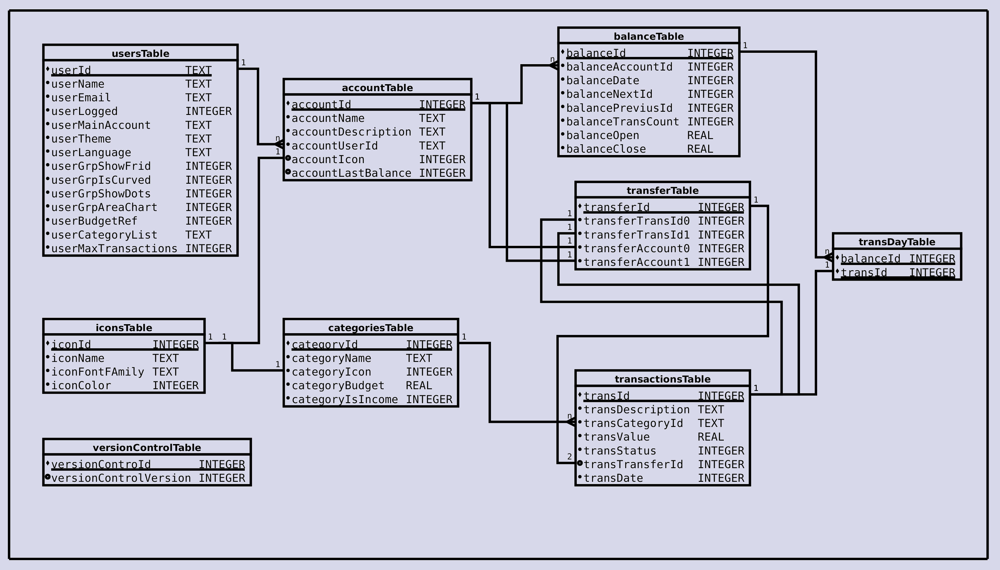

# Finance App (pt_BR)

By *rudsonalves67@gmail.com*

The intention of this project is to develop an application to assist in user budget control, allowing the creation and management of accounts. The project was inspired by the diagram published on Figma, [Financy-App](https://www.figma.com/file/vQzApZhqZFDFp1td5K4asQ/Financy-App?type=design&mode=design&t=EFvH3bvOxfe8hSap-0), and was initially developed based on videos from the YouTube channel [@devkaio](https://www.youtube.com/@devkaio), to which I am very grateful for the good practices and interesting ideas that helped implement the project.

## Code Development

This project aims to enhance my knowledge in the Flutter SDK and the entire ecosystem involved in application development.

Overall, the project is being developed following a feature-based architecture, where components and modules related to a specific feature are grouped into a logical structure, facilitating code comprehension and maintenance.

Pages are built using the State pattern, where the page's construction changes when its internal state changes. Generally, a page will have a module with an abstract class, and its subclasses extend this abstract class to define their different states. A second control module is responsible for managing the states used in the page's construction. The third module is responsible for building the page itself, depending on the current state.

The Service Locator used is *get_it*, which provides a way to centralize and obtain instances of necessary services throughout the application. It is also capable of generating Singleton objects and on-demand instances, offering great flexibility in resource distribution and control.

## Project Planning

1. The first version of the application will have the following features:

   - Creation and management of accounts in Firebase;
   - Local database with all wallet information;
   - Local login control (*flutter_secure_storage*);
   - Implementation of a settings page with:
     - Theme control;
     - Language selection;
     - Other product information (possibly an *About* page);
   - Support for Portuguese and English languages;
   - Single wallet functionality.

2. For upcoming versions, the plan includes:

   - Support for multiple wallets;
   - Addition of general graphical analysis;
   - Support for one more language (Spanish).

## Resources

Initially, the application will only manage financial movements for one wallet. In future versions, I plan to implement graphical financial analysis, projections, and support for multiple wallets.

The application uses the following packages:

- **get_it: ^7.6.0** - provides access to application components throughout the widget tree. Service Locator;
- **firebase_auth: ^4.6.1** - authentication;
- **firebase_core: ^2.13.0**;
- **flutter_secure_storage: ^8.0.0** - storage of login information and application status. Eventually, I plan to replace it with the *sqflite* package;
- **sqflite: ^2.2.8+4** - database for storing user wallet information;
- **path_provider: ^2.0.15** - obtaining commonly used locations in the host platform's file system, such as temporary and application data directories;
- **path: ^1.8.3** - library for path manipulation based on strings;
- **intl: ^0.18.0** - will be used for date formatting and parsing;
- **flutter_localization: ^3.0.2** - Flutter's standard internationalization;
- **dynamic_color: ^1.6.5** - Flutter package to create material color schemes based on dynamic platform-specific color implementations.

The project also uses icons from [Material Symbols](https://fonts.google.com/icons).

## Database

### 1. Table "usersTable":

This table is used to store information about users, such as their IDs, names, email addresses, and login status (0 - false and 1 - true), theme, language, and others.

### 2. Table "accountTable":

This table is used to store information about user accounts. Each account has an ID, a name, an associated user ID, and an image.

Index created for the *accountUserId* column.

The *accountLastBalance* column has been added to store the ID of the last balance recorded in the wallet. Financial movement queries will start from this balance and move backward in time until finding a balance with a null *balancePreviousId*, indicating that this is the first balance recorded in this wallet. Similarly, the *balanceNextId* of the balance with an *id* equal to *accountLastBalance* should be null, indicating that this is the last balance recorded in the account.

### 3. Table "balanceTable":

This table is used to store information about wallet balances on the specified *balanceDate*. Each entry in the table represents a specific balance in a wallet. Fields include the ID of the associated wallet, the balance ID, the IDs of the previous and next balances, as well as the opening and closing values of the balance. Essentially, this table is a linked list of balances.

Index created for the *balanceDate* and *balanceAccountId* columns.

A null value in *balancePreviousId* indicates that this is the first balance recorded in this account. Similarly, a null value in *balanceNextId* indicates that this is the last balance recorded in this account.

### 4. Table "categoriesTable":

This table is used to store information about categories of financial transactions. Each category has an ID, a name, and an associated image.

Index created for the *categoryName* column.

### 5. Table "transactionsTable":

This table is used to store information about financial transactions. Each transaction has an ID, a description, a category ID, a value, a status, and a date.

Index created for the *transDate* column.

A *transTransferId* column was added to store the ID of a transfer between accounts. This column can be null, indicating that the transaction is not a transfer between accounts. This column was added to facilitate the identification of transactions related to a transfer, as well as the data of this transfer.

### 6. Table "transDayTable":

This table is used to relate specific transactions to specific balances in the *balanceTable*. It is used as a junction table to create a relationship between transactions and balances in wallets.

### 7. Table "transfersTable":

This table maintains information about the IDs of transactions and the accounts where a transfer was initiated.

### 8. Table "versionControlTable":

This table was created to maintain control over database versions.

### 9. Table "iconsTable":

This table maintains icon definitions (name, fontFamily, color) used in categoriesTable and accountsTable.

### Triggers

Two triggers were created to validate entries in the *balanceNextId* and *balancePreviousId* columns in the *balanceTable*. In the trigger bodies, it is checked whether the value inserted in *balanceNextId* or *balancePreviousId* is null or corresponds to a valid *balanceId* in the *balanceTable*. Otherwise, an error is generated.

With these triggers in place, any attempt to insert an invalid value in *balanceNextId* or *balancePreviousId* will result in an error, and the insertion operation will be interrupted, thus maintaining the referential

 integrity of this data.

# Bug Fixes and Implementations

Some bugs were noticed and need to be fixed:

- *20230623.3.* Implementation: There are currently two functions in the *lib/common/functions* directory;
- *20230818.3* Bug: o back está levando para a página de apresentação. Trocar pela página inicial.

These bug fixes and implementations will help improve the user experience and make the app more complete and stable.

# Aplicativo de Finanças (pt_BR)

Por *rudsonalves67@gmail.com*

A intenção deste projeto é desenvolver um aplicativo para auxiliar no controle do orçamento do usuário, permitindo a criação e gerenciamento de contas. O projeto foi inspirado no diagrama publicado no Figma, [Financy-App](https://www.figma.com/file/vQzApZhqZFDFp1td5K4asQ/Financy-App?type=design&mode=design&t=EFvH3bvOxfe8hSap-0), e foi inicialmente desenvolvido com base nos vídeos do canal do YouTube [@devkaio](https://www.youtube.com/@devkaio), do qual sou muito grato pelas boas práticas e ideias interessantes que ajudaram a implementar o projeto.

## Desenvolvimento do Código

Este projeto tem como objetivo aprimorar meus conhecimentos no SDK Flutter e em todo o ecossistema envolvido no desenvolvimento do aplicativo.

No geral, o projeto está sendo desenvolvido seguindo uma arquitetura baseada em funcionalidades, na qual os componentes e módulos relacionados a uma determinada funcionalidade são agrupados em uma estrutura lógica, facilitando a compreensão e a manutenção do código.

As páginas são construídas usando o padrão State, no qual a construção da página é alterada quando seu estado interno muda. Em geral, uma página terá um módulo com uma classe abstrata e suas subclasses estendem essa classe abstrata para definir seus diferentes estados. Um segundo módulo de controle é responsável por gerenciar os estados utilizados na construção da página. O terceiro módulo é responsável pela construção da própria página, dependendo do estado atual.

O Service Locator utilizado é o *get_it*, que fornece uma maneira de centralizar e obter instâncias de serviços necessários ao longo do aplicativo. Ele também é capaz de gerar objetos Singleton e sob demanda, oferecendo uma grande flexibilidade na distribuição e controle dos recursos.

## Planejamento do Projeto

1. A primeira versão do aplicativo terá as seguintes características:

   - Criação e gerenciamento de contas no Firebase;
   - Banco de dados local com todas as informações das carteiras;
   - Controle local de login (*flutter_secure_storage*);
   - Implementação de uma página de configurações com:
     - Controle de tema;
     - Seleção de idioma;
     - Outras informações sobre o produto (possivelmente uma página *Sobre*);
   - Suporte aos idiomas português e inglês;
   - Funcionalidade de carteira única.

2. Para as próximas versões, está planejado:

   - Suporte a múltiplas carteiras;
   - Adição de análises gráficas gerais;
   - Suporte a mais um idioma (espanhol).

## Recursos

Inicialmente, o aplicativo irá gerenciar apenas a movimentação financeira de uma carteira. Em versões futuras, pretendo implementar análises gráficas das finanças, projeções e suporte a várias carteiras.

O aplicativo utiliza os seguintes pacotes:

- **get_it: ^7.6.0** - fornece acesso a componentes do aplicativo ao longo da árvore de widgets. Service Locator;
- **firebase_auth: ^4.6.1** - autenticação;
- **firebase_core: ^2.13.0**;
- **flutter_secure_storage: ^8.0.0** - armazenamento de informações de login e status do aplicativo. Eventualmente, pretendo substituí-lo pelo pacote *sqflite*;
- **sqflite: ^2.2.8+4** - banco de dados para armazenamento das informações das carteiras do usuário;
- **path_provider: ^2.0.15** - obtenção de locais comumente usados no sistema de arquivos da plataforma host, como diretórios temporários e de dados do aplicativo;
- **path: ^1.8.3** - biblioteca para manipulação de caminhos baseada em strings;
- **intl: ^0.18.0** - será usado para formatação e análise de datas;
- **flutter_localization: ^3.0.2** - internacionalização padrão do Flutter;
- **dynamic_color: ^1.6.5** - pacote Flutter para criar esquemas de cores de materiais com base na implementação de cores dinâmicas de uma plataforma.

O projeto também utiliza os ícones do [Material Symbols](https://fonts.google.com/icons).

## Banco de Dados

### 1. Tabela "usersTable":

Essa tabela é usada para armazenar informações sobre os usuários, como seus IDs, nomes, endereços de e-mail e estado de login (0 - false e 1 - true), tema, linguagem e outros.

### 2. Tabela "accountTable":

Essa tabela é usada para armazenar informações sobre as contas dos usuários. Cada conta possui um ID, um nome, um ID de usuário associado e uma imagem.

Índice criado para a coluna *accountUserId*.

A coluna *accountLastBalance* foi adicionada para armazenar o ID do último saldo registrado na carteira. As consultas de um lançamento financeiro irão começar por este saldo e retroceder no tempo até encontrar um saldo com *balancePreviousId* nulo, indicando que este é o primeiro saldo registrado nesta carteira. De forma semelhante, o *balanceNextId* do saldo com *id* igual a *accountLastBalance* deve ser nulo, indicando que este é o último saldo registrado na conta.

### 3. Tabela "balanceTable":

Essa tabela é usada para armazenar informações sobre os saldos das carteiras na data especificada em *balanceDate*. Cada entrada na tabela representa um saldo específico em uma carteira. Os campos incluem o ID da carteira associada, o ID do saldo, os IDs do saldo anterior e seguinte, bem como os valores de abertura e fechamento do saldo. Essencialmente, essa tabela é uma lista encadeada dos saldos.

Índice criado para as colunas *balanceDate* e *balanceAccountId*.

Um valor nulo em *balancePreviousId* indica que este é o primeiro saldo registrado nesta conta. De forma semelhante, um valor nulo em *balanceNextId* indica que este é o último saldo registrado nesta conta.

### 4. Tabela "categoriesTable":

Essa tabela é usada para armazenar informações sobre as categorias das transações financeiras. Cada categoria possui um ID, um nome e uma imagem associada.

Índice criado

 para a coluna *categoryName*.

### 5. Tabela "transactionsTable":

Essa tabela é usada para armazenar informações sobre as transações financeiras. Cada transação possui um ID, uma descrição, um ID de categoria, um valor, um status e uma data.

Índice criado para a coluna *transDate*.

Foi adicionada uma coluna *transTransferId* para armazenar a ID de uma transferência entre contas. Esta coluna pode ser nula, indicando que a transação não se trata de uma transferência entre contas. Esta coluna foi adicionada para facilitar a identificação das transações relativas a uma transferência, bem como os dados desta transferência.

### 6. Tabela "transDayTable":

Essa tabela é usada para relacionar transações específicas com saldos específicos na tabela *balanceTable*. Ela é usada como uma tabela de junção para criar uma relação entre transações e saldos nas carteiras.

### 7. Tabela "transfersTable":

Esta tabela mantém as informações das IDs das transações e das contas onde uma transferência foi criada.

### 8. Tabela "versionControlTable":

Esta tabela foi criada para manter o controle de versões do banco de dados.

### 9. Tabela "iconsTable":

Esta tabela mantém as definições de ícones (nome, fontFamily, cor), usadas em categoriesTable e accountsTable

### Gatilhos

Foram criados dois gatilhos (triggers) para validar as entradas das colunas *balanceNextId* e *balancePreviousId* na tabela *balanceTable*. No corpo dos gatilhos, é verificado se o valor inserido em *balanceNextId* ou *balancePreviousId* é nulo ou corresponde a um *balanceId* válido na tabela *balanceTable*. Caso contrário, um erro é gerado.

Com esses gatilhos em vigor, qualquer tentativa de inserir um valor inválido em *balanceNextId* ou *balancePreviousId* resultará em um erro, e a operação de inserção será interrompida, mantendo assim a integridade referencial desses dados.
