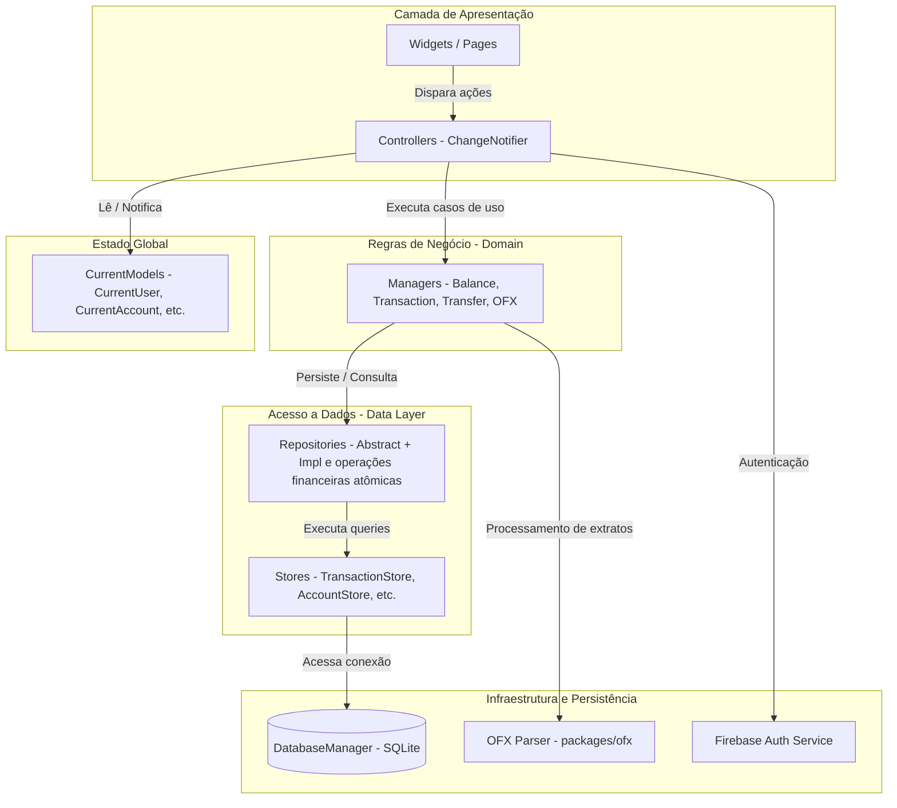
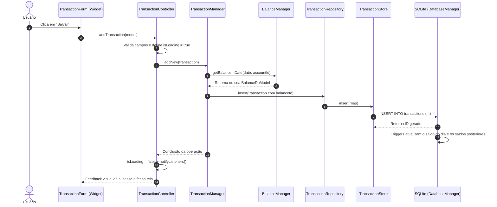

# Arquitetura do Projeto Finances

Este documento descreve a arquitetura de software, padrões de projeto, fluxo de dados, persistência e infraestrutura do aplicativo **Finances**.

---

## 1. Visão Geral e Padrão Arquitetural

O **Finances** adota uma arquitetura em camadas com *service locator*, combinando:
- **Presentation Layer**: Widgets e Telas Flutter (Material 3 com Dynamic Color).
- **State Management**: `ChangeNotifier` em Controllers dedicados para estado de tela e `ValueNotifier` em `CurrentModels` para estado global da sessão.
- **Domain / Business Layer**: `Managers` (classes *sealed* com métodos estáticos) centralizando regras de negócio financeiras e orquestração.
- **Data Access Layer**: Padrão **Repository** com interfaces abstratas (`Abstract*Repository`) desacopladas de suas implementações.
- **Store / Persistence Layer**: Classes `*Store` gerenciando queries SQL estruturadas sobre o `DatabaseManager` (SQLite).
- **Dependency Injection**: Centralizada no `GetIt` (`locator.dart`).



---

## 2. Estrutura de Diretórios (`lib/`)

```
lib/
├── app_finances.dart            # Configuração raiz MaterialApp, temas e rotas
├── firebase_options.dart        # Configuração do Firebase por plataforma
├── locator.dart                 # Configuração do Service Locator (GetIt)
├── main.dart                    # Ponto de entrada, inicialização assíncrona
├── common/                      # Código compartilhado entre módulos
│   ├── constants/               # Constantes globais, temas e ícones
│   ├── current_models/          # Notificadores de estado da sessão ativa
│   ├── extensions/              # Extensões Dart (ExtendedDate, MoneyMaskedText, etc.)
│   ├── functions/               # Funções utilitárias e helpers
│   ├── models/                  # Modelos de dados e DTOs (DB Models)
│   ├── validate/                # Validadores de formulários e regras de entrada
│   └── widgets/                 # Componentes de UI reutilizáveis
├── features/                    # Módulos verticais de funcionalidades (UI + Controller)
│   ├── account/                 # Gestão de contas bancárias
│   ├── categories/              # Gestão de categorias
│   ├── home_page/               # Tela principal, dashboard e cards de balanço
│   ├── ofx_page/                # Importação e mapeamento de extratos OFX
│   ├── sign_in/ & sign_up/      # Fluxos de autenticação
│   ├── splash/ & onboarding/    # Telas iniciais e de boas-vindas
│   ├── statistics/              # Gráficos e relatórios financeiros
│   └── settings/ & about/       # Configurações gerais e sobre o app
├── manager/                     # Regras de negócio centrais (Managers)
├── packages/                    # Pacotes internos encapsulados
│   └── ofx/                     # Parser e manipulador de arquivos OFX
├── repositories/                # Interfaces e implementações de repositórios
├── services/                    # Integração com serviços externos (Auth)
└── store/                       # Camada SQLite, migrations, backup e stores
```

---

## 3. Fluxo de Dados e Ciclo de Vida de uma Operação

O exemplo a seguir ilustra o fluxo completo de uma inserção de transação financeira:



---

## 4. Camada de Domínio e Lógica de Negócio (`lib/manager/`)

Os `Managers` são classes *sealed* responsáveis por garantir consistência contábil e orquestrar operações entre múltiplos repositórios:

| Manager                       | Responsabilidade Principal                                                                                                                             |
| :---------------------------- | :----------------------------------------------------------------------------------------------------------------------------------------------------- |
| **`BalanceManager`**          | Garante existência de saldo diário (`getBalanceInDate`), herda fechamento anterior como abertura e propaga ajustes retroativos para datas posteriores. |
| **`TransactionManager`**      | Adiciona (`addNew`), atualiza e remove transações, recalculando saldos do dia e atualizando balanços futuros.                                          |
| **`TransferManager`**         | Valida e delega débito, crédito e registro da transferência ao repositório de operações financeiras, dentro de uma transação SQLite.                  |
| **`OfxAccountManager`**       | Faz o vínculo entre contas informadas no arquivo OFX e contas cadastradas no aplicativo.                                                               |
| **`OfxRelationshipManager`**  | Mapeia transações bancárias externas com categorias e contas internas.                                                                                 |
| **`OfxTransTemplateManager`** | Regras e modelos para pré-categorização de transações importadas.                                                                                      |

---

## 5. Persistência de Dados (SQLite)

A persistência local utiliza o `sqflite` encapsulado pelo `DatabaseManager` singleton.

### 5.1. Schema do Banco de Dados (11 Tabelas)
Definidas em `lib/store/tables_creators.dart`:

1. `app_control`: Configurações internas de controle do banco e flags do sistema.
2. `users`: Informações de identificação local do usuário ativo.
3. `icons`: Catálogo de ícones disponíveis para contas e categorias.
4. `accounts`: Contas financeiras (corrente, poupança, carteira, etc.).
5. `balance`: Registros diários de saldo (`openingBalance`, `closingBalance`) indexados por `date` e `accountId`.
6. `category`: Categorias e subcategorias de receitas e despesas.
7. `transactions`: Lançamentos financeiros individuais (tipo, valor, data, conta, categoria).
8. `transfers`: Histórico de transferências vinculando as transações de débito e crédito.
9. `ofx_account`: Contas bancárias detectadas em extratos OFX.
10. `ofx_relationship`: Relações de mapeamento entre lançamentos OFX e o sistema.
11. `ofx_transactions`: Histórico de transações brutas importadas via OFX para controle de duplicidade (`fitid`).

### 5.2. Versionamento e Migrações (`database_migrations.dart`)
- As alterações de schema utilizam controle de versão sequencial com scripts `ALTER TABLE` / `CREATE INDEX` retrocompatíveis.
- O versionamento segue a convenção `10xx` (ex: `1011` = base 1.0 + 11 migrações aplicadas).

### 5.3. Backup e Restauração (`database_backup.dart`)
- Exportação e importação completa de base SQLite para cópia de segurança e recuperação de desastres.

---

## 6. Integrações e Serviços Externos

### 6.1. Autenticação (Firebase Auth)
- Interface `AuthService` com implementação `FirebaseAuthService`.
- Permite autenticação por E-mail e Senha, recuperação e logout.
- Estrutura projetada para permitir mocks ou provedores alternativos sem alterar a aplicação.

### 6.2. Parser OFX (`lib/packages/ofx/`)
- Módulo interno que processa extratos bancários nos formatos **OFX v1.02 (SGML)** e **OFX v2.x (XML)**.
- Normalização de variações bancárias (Itaú, Bradesco, Banco do Brasil, Santander, Nubank, Inter, etc.).
- Conversão para DTOs tipados prontos para importação sem dependências externas complexas.

---

## 7. Gerenciamento de Estado e Injeção de Dependência

### 7.1. Injeção de Dependência (`lib/locator.dart`)
Utiliza `GetIt` com três padrões de ciclo de vida:
- **Singleton**: Instâncias únicas de longa duração (`AuthService`, `DatabaseManager`).
- **Lazy Singleton**: Repositories, Stores e `CurrentModels` instanciados sob demanda.
- **Factory**: Controllers de autenticação e splash recriados por uso.
- **Lazy Singleton**: Demais controllers atualmente preservam estado durante a sessão.

### 7.2. Modelos de Sessão Global (`CurrentModels`)
Estendem `ChangeNotifier` ou utilizam `ValueNotifier` para fornecer dados contextuais em toda a aplicação:
- `CurrentUser`: Usuário autenticado ativo.
- `CurrentAccount`: Conta atualmente selecionada no dashboard.
- `CurrentBalance`: Saldo calculado em tempo real para o contexto ativo.
- `CurrentTheme`: Modo de tema ativo (`ThemeMode.system`, `ThemeMode.light`, `ThemeMode.dark`).
- `CurrentLanguage`: Idioma ativo (`Locale`).

---

## 8. Internacionalização e Sistema de Temas

### 8.1. Internacionalização (l10n)
- Baseada em arquivos `.arb` em `lib/l10n/` com suporte a 7 idiomas:
  - Português do Brasil (`pt_BR`) e Portugal (`pt`)
  - Inglês (`en`)
  - Alemão (`de`)
  - Espanhol (`es`)
  - Francês (`fr`)
  - Italiano (`it`)
- Geração automática pelo `gen-l10n` do Flutter e acesso tipado via `AppLocalizations.of(context)`.

### 8.2. Sistema de Design e Temas
- **Material 3** habilitado.
- Suporte a **Dynamic Color** (Android 12+) para integração com a paleta do sistema operacional do usuário.
- Alternância reativa via `AnimatedBuilder` no nível de `MaterialApp` em [lib/app_finances.dart](../lib/app_finances.dart).
