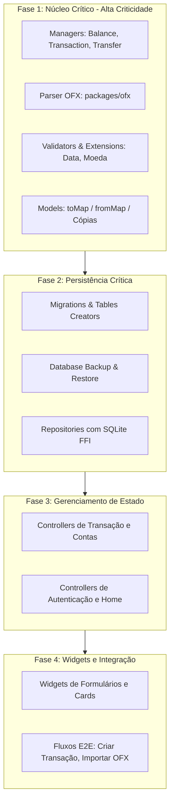

# Plano de Aumento de Cobertura de Testes

## Visão Geral
A aplicação *Finances* possui uma arquitetura bem modularizada (Models, Repositories, Managers, Services e Controllers), porém carece de testes automatizados na pasta `test/`.

Em aplicações financeiras, falhas em cálculos de saldo, integridade de transações, transferências e parsing de extratos (OFX) têm impacto crítico. O objetivo deste planejamento é estruturar o aumento progressivo de cobertura focando nas partes mais vitais do sistema.



---

## 1. Matriz de Priorização de Testes

| Camada / Componente                                                             |   Criticidade    | Risco se Falhar                                                               | Tipo de Teste           |
| :------------------------------------------------------------------------------ | :--------------: | :---------------------------------------------------------------------------- | :---------------------- |
| **`lib/manager/`** (`BalanceManager`, `TransactionManager`, `TransferManager`)  | **P0 (Crítica)** | Saldo calculado errado, transações órfãs, inconsistência histórica de balanço | Unitário + integração |
| **`lib/packages/ofx/`** & **OFX Managers**                                      | **P0 (Crítica)** | Importação duplicada ou valores corrompidos de extratos bancários             | Unitário                |
| **`lib/common/validate/`** & **Extensions** (`MoneyMaskedText`, `ExtendedDate`) |  **P1 (Alta)**   | Validação incorreta de campos, formatação e arredondamento errados            | Unitário                |
| **`lib/common/models/`**                                                        |  **P1 (Alta)**   | Perda de dados em serialização SQLite (`toMap`/`fromMap`)                     | Unitário                |
| **`lib/features/**/**_controller.dart`**                                        |  **P1 (Alta)**   | Falhas de transição de estado, feedback ao usuário quebrado                   | Unitário / State        |
| **`lib/store/database/`** (`Migrations`, `Backup`)                              | **P0/P1 (Crítica)** | Perda ou corrupção de dados em atualizações e restaurações                 | Integração (SQLite FFI + Android) |
| **`lib/repositories/`**                                                         |  **P2 (Média)**  | Queries SQL quebradas, constraints violadas                                   | Integração / Unitário   |
| **`lib/features/**/widgets/`** (UI/Forms)                                       |  **P2 (Média)**  | Fluxos de gravação, validação ou navegação quebrados                            | Widget / `integration_test` |

---

## 2. Detalhamento por Fases

### 🟢 Fase 1: Núcleo de Regras de Negócio e Cálculos (Prioridade P0 / P1)

1. **Gestão de Transações e Balanços (`lib/manager/`)**:
   - `BalanceManager.getBalanceInDate`:
     - Criar novo balanço herdando o saldo de fechamento do dia anterior.
     - Retornar balanço existente sem duplicar registros.
     - Comportamento quando é o primeiro balanço do histórico.
   - `TransactionManager.addNew`:
     - Em unidade, verificar a associação ao balanço e a inserção no repositório.
     - Em SQLite, verificar os triggers que atualizam o saldo do dia e propagam para balanços futuros.
   - `TransactionManager.remove`:
     - Remoção de transação: estorno correto nos balanços subsequentes.
   - `TransferManager.add`:
     - Implementar uma transação SQLite e testar rollback do débito, crédito e registro da transferência em cada ponto de falha.
   - Invariantes monetárias:
     - Cobrir arredondamento em centavos, acúmulo, valores extremos e avaliar a substituição de `double`/`REAL`.

2. **Parser OFX (`lib/packages/ofx/`)**:
   - Parse de arquivos OFX válidos (diferentes bancos: Itaú, Bradesco, Nubank, etc.).
   - Tratamento de arquivos OFX corrompidos, com tags ausentes ou codificações distintas (ex: ANSI / UTF-8).
   - Conversão correta de datas e valores decimais (sinais positivos/negativos).

3. **Validações e Utilitários (`lib/common/validate/`, `extensions/`)**:
   - `TransactionValidator`, `AccountValidator`, `SignValidator`.
   - `MoneyMaskedText` (formatação monetária e conversão para double/centavos).
   - `ExtendedDate` (operações com datas, início/fim de mês, comparações).

4. **Modelos de Dados (`lib/common/models/`)**:
   - Testar `fromMap` e `toMap` de `TransactionDbModel`, `BalanceDbModel`, `AccountDbModel`, `TransferDbModel`.
   - Garantir que tipos `null`, booleanos (0/1 no SQLite) e inteiros/doubles são convertidos com fidelidade.

---

### 🟡 Fase 3: Controllers e Gerenciamento de Estado (Prioridade P1)

Testar os `ChangeNotifier` Controllers isolando os repositórios/serviços via `mocktail`:

1. **`TransactionController` & `AccountController`**:
   - Estado de carregamento (`isLoading`), sucesso e erro.
   - Testar somente as operações expostas por cada API atual; navegação e responsabilidades da View ficam em testes de widget.
2. **`SignInController` & `SignUpController`**:
   - Fluxo de autenticação com sucesso, credenciais inválidas e erro de rede.
   - Notificação de mensagens de erro amigáveis para a UI.
3. **`HomePageController` & `BalanceCardController`**:
   - Atualização do resumo financeiro ao alterar a conta selecionada ou o mês de referência.

---

### 🟠 Fase 2: Persistência e Infraestrutura (Prioridade P0/P1)

Primeiro tornar `DatabaseManager` injetável por `DatabaseFactory`, caminho e filesystem. Depois utilizar `sqflite_common_ffi` em memória e manter uma suíte Android para diferenças de plataforma:

1. **Migrations e Schema (`lib/store/database/database_migrations.dart`, `lib/store/tables_creators.dart`)**:
   - Criação inicial de todas as tabelas, índices e triggers.
   - Execução de upgrades de `1000` até a versão atual, com rollback e reativação de foreign keys em falhas.
2. **Backup e Recuperação (`lib/store/database/database_backup.dart`)**:
   - Exportação do banco atual para arquivo de backup.
   - Restauração de arquivo de backup e validação da integridade pós-restore.

---

### 🔵 Fase 4: Widgets e Fluxos Críticos (Prioridade P1/P2)

1. **Testes de Componentes Visuais**:
   - Form de Nova Transação: validação de campos obrigatórios ao clicar em salvar sem preencher.
   - `BalanceCard`: exibição correta de cores e valores (positivo em verde, negativo em vermelho).
2. **Smoke Tests de Fluxo**:
   - Fluxo de login -> Home -> Adicionar Transação -> Visualizar saldo atualizado.

3. **E2E com `integration_test`**:
   - Executar persistência, transferência, reinício e seleção de arquivo em emulador/dispositivo.

### Processo contínuo: Bugs e regressões

- Registrar reprodução, severidade, impacto nos dados e versões afetadas.
- Criar primeiro um teste que reproduza o bug e falhe.
- Não encerrar bugs P0/P1 sem teste de regressão e evidência de que não restaram dados parciais.

---

## 3. Preparação do Ambiente e Infraestrutura de Testes

### Dependências adicionais no `pubspec.yaml` (em `dev_dependencies`):
- `sqflite_common_ffi: ^2.3.0+5` *(permite rodar testes de SQLite direto na VM Dart/Desktop)*.

### Padrão de Setup para Injeção de Dependências (`GetIt` / `locator`):
```dart
// test/test_helpers/test_setup.dart
import 'package:finances/locator.dart';
import 'package:mocktail/mocktail.dart';

Future<void> setupTestLocator() async {
  await locator.reset(dispose: true);
  // Registrar mocks padrão para AbstractBalanceRepository, AbstractTransactionRepository, etc.
}

Future<void> tearDownTestLocator() async {
  await locator.reset(dispose: true);
}
```

### Estrutura de Pastas de Teste Recomendada:
```
test/
├── helpers/
│   ├── mocks.dart
│   ├── test_setup.dart
│   └── fixtures/ (arquivos .ofx de exemplo)
├── unit/
│   ├── common/
│   │   ├── models/
│   │   ├── validate/
│   │   └── extensions/
│   ├── manager/
│   │   ├── balance_manager_test.dart
│   │   ├── transaction_manager_test.dart
│   │   └── transfer_manager_test.dart
│   ├── packages/
│   │   └── ofx/
│   └── features/ (controllers)
├── integration/
│   └── database/
│       ├── database_migrations_test.dart
│       └── database_backup_test.dart
└── widget/
    └── features/
integration_test/
└── critical_flows_test.dart
```

## 4. Estratégia de medição

- Registrar a linha de base com `flutter test --coverage` e excluir código gerado.
- Adotar um limite incremental no CI.
- Usar cobertura como sinal de lacunas, não como meta isolada; invariantes P0, falhas e rollbacks são obrigatórios independentemente do percentual.
